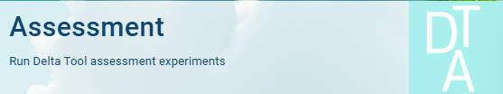

Main page
=========

.. toctree::
   :maxdepth: 3

Delta Tool Online is a Voilà dashboard running as a Jupyter Notebook inside the JRC BDAP platform (Big Data Analytics Platform, the on-premise JRC cloud service). It can be reached at  `this URL <https://jeodpp.jrc.ec.europa.eu/eu/vaas/voila/render/fairmode/fairmode/DeltaTool.ipynb>`_, by providing EU-login account credentials.

Information on EU login, the central authentication service of the European institutions, bodies, and agencies, can be obtained from `this page <https://trusted-digital-identity.europa.eu/index_en>`_, where it is also possible to register and create a new EU login account.

Start page
----------

.. figure:: graphics/mainpage.png

   Main application page
   
   
To start the **assessment** tool click on the left button:

   Start button of the Assessment tool

To start the **forecasting** tool click on the right button:

   Start button of the Forecasting tool

