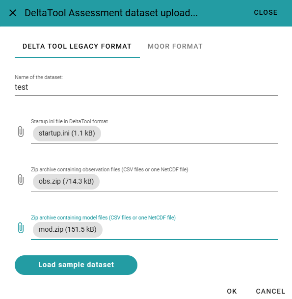
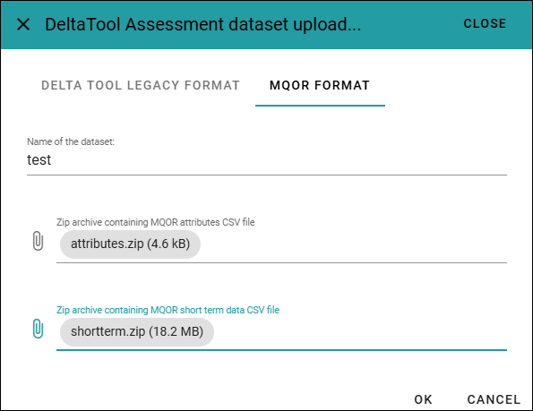
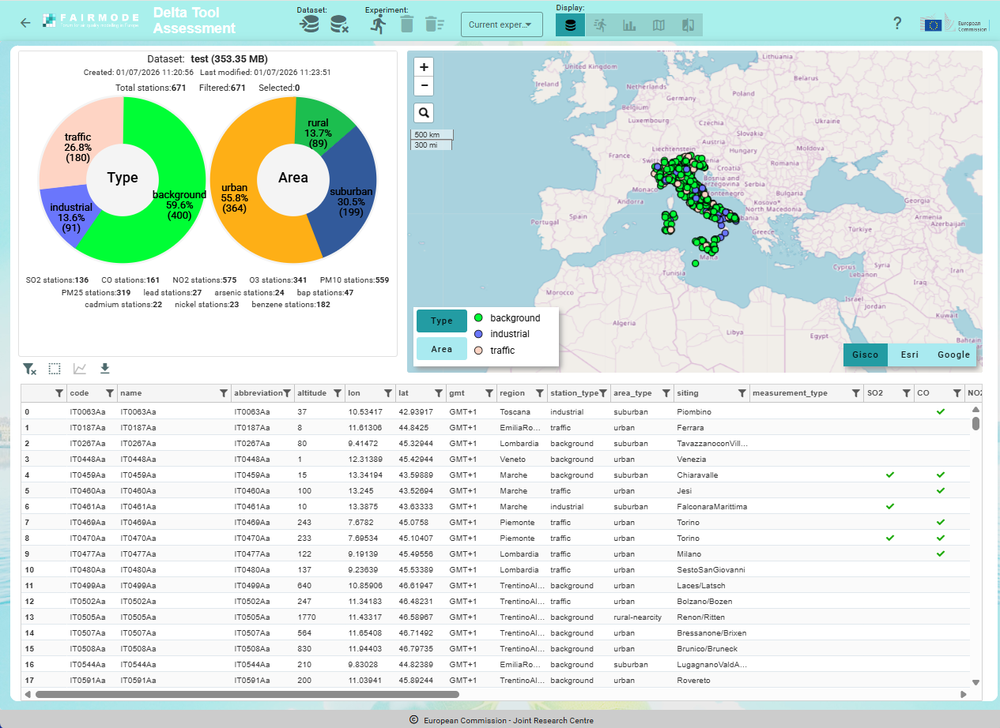
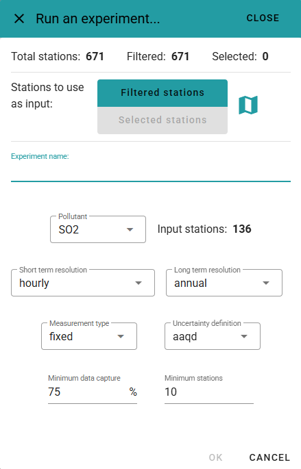
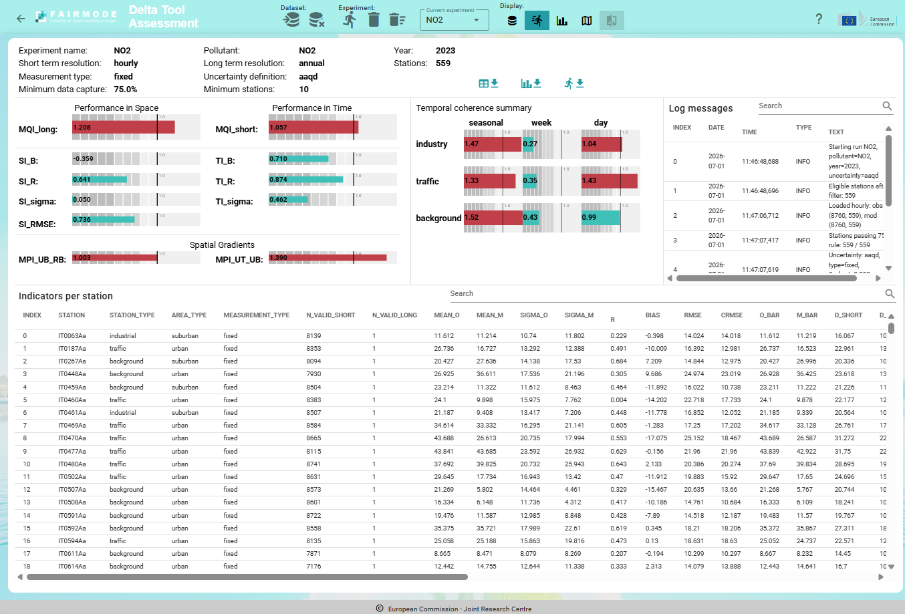
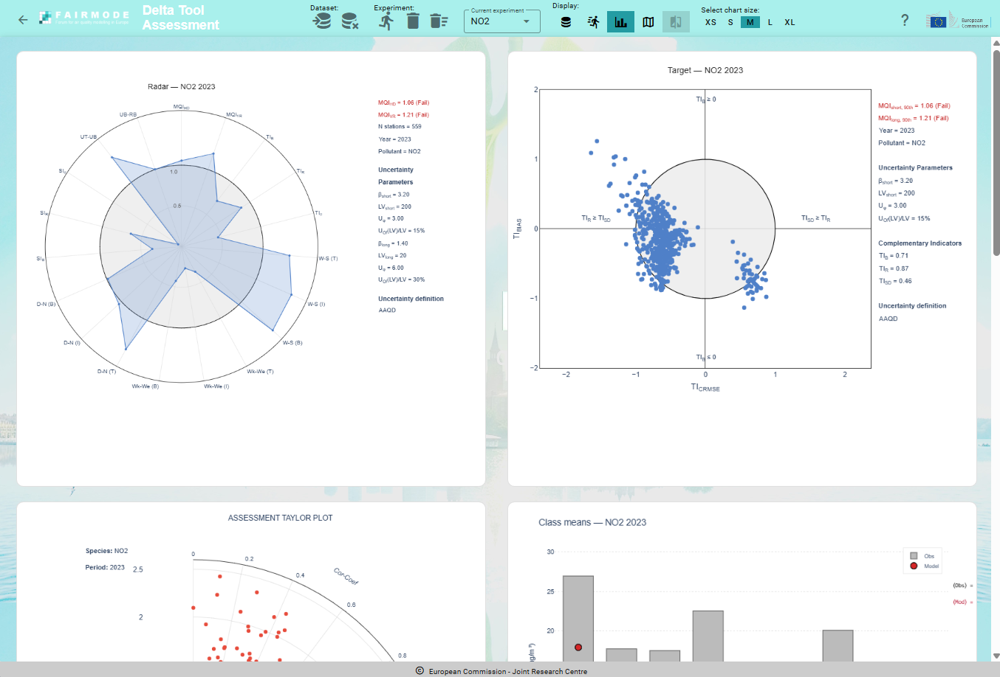
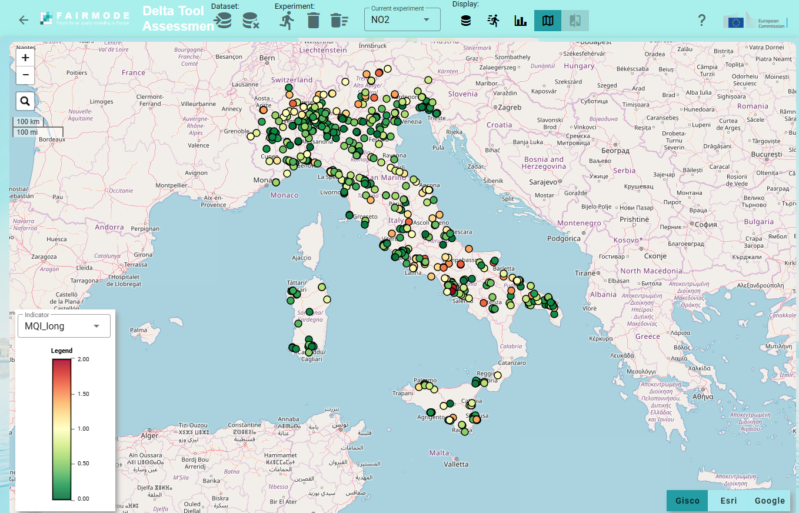

Assessment
==========

.. toctree::
   :maxdepth: 3
   
Load your dataset
-----------------

Delta Tool Online enables the users to upload their own datasets containing stations and air quality monitoring data. The accepted formats are the **Delta Tool Legacy format** (startup.ini file and two CSV files for each station, one for the observations and one for the model), and the **MQOR format**.

The **Delta Tool legacy format** is described in detail in the `Assessment inputs section <fmm_assess/TECH_SPEC_fmm_assess.html#inputs>`_.

.. warning::

    Although the underlying **fmm_assess** library supports both CSV and NetCDF format for stations data, currently only the CSV version of the format is supported by the Delta Tool Online.
    
The **MQOR format** is described in the `MQOR main repository <https://code.europa.eu/jrcairqualitymodelling/mqor>`_.

Load the sample dataset
^^^^^^^^^^^^^^^^^^^^^^^

The simplest way to start using the Delta Tool Online is to click the "Load sample dataset" button in the Dataset upload dialog-box (see screenshot on the following chapter). This function loads, inside the user storage space, a simple dataset consisting of around 50 stations covering all european countries. After the loading, a download of the dataset can be useful to better understand the correct input format for guiding the uploading of your own dataset. Please refer to the :ref:`Stations toolbar` section to see how to download your current dataset.

Load a dataset in the Delta Tool legacy format
^^^^^^^^^^^^^^^^^^^^^^^^^^^^^^^^^^^^^^^^^^^^^^

To upload a dataset in the Delta Tool legacy format, the user must select, from its local machine, the startup.ini file and two .zip archives: one containing one CSV for each station for the observation data, and the second containing one CSV for each station for the model data. 

.. note::

    The two .zip archives containing CSV files will be exploded in "flat" mode, meaning that all files are extracted in the same folder on the server storage. This means that the directory structure inside the .zip archive is not taken into consideration.
    

   Load dataset using the legacy Delta Tool format

Load a dataset in the MQOR format
^^^^^^^^^^^^^^^^^^^^^^^^^^^^^^^^^

To upload a dataset in the MQOR format, the user must select, from its local machine, two .zip archives: the first .zip archive must contain a single CSV file with the attributes data (i.e. the stations info, analogous to the startup.ini file for the Delta Tool legacy format), the second .zip archive must contain a single CSV file with all the short term observation and model values for all the stations.

   Load dataset using the MQOR format

After the loading
^^^^^^^^^^^^^^^^^

As soon as the input files are selected and transferred to the server storage, the Delta Tool Onlina application performs some consistency checks on the uploaded data, trying to detect possible error and inconsistency in the data. In case some inconsistency are detected, they are shown to the user in a dedicated window, otherwise the loaded dataset display is activate at the end of the checks.

    

   Consistency checks on the uploaded dataset
   

If the loading is successfull, the dataset display mode is activated, as shown in the following figure:

   Display of the uploaded dataset
   

To start analysing the content of your dataset and to filter/select the input stations for your experiments, please see :ref:`Dataset summary, stations filtering and selection` chapter where all the available functions (which are common to the assessment and forecasting section of the tool) are listed and explained.

Run an experiment
-----------------

   Input parameters for running an experiment

Analyse experiment results
--------------------------

Numerical results
^^^^^^^^^^^^^^^^^

   Numerical results of an assessment experiment
   

Charts outputs
^^^^^^^^^^^^^^

   Graphical results of an assessment experiment

Map output
^^^^^^^^^^

   Map visualization of output indicators per station
   

Compare two experiments
-----------------------
