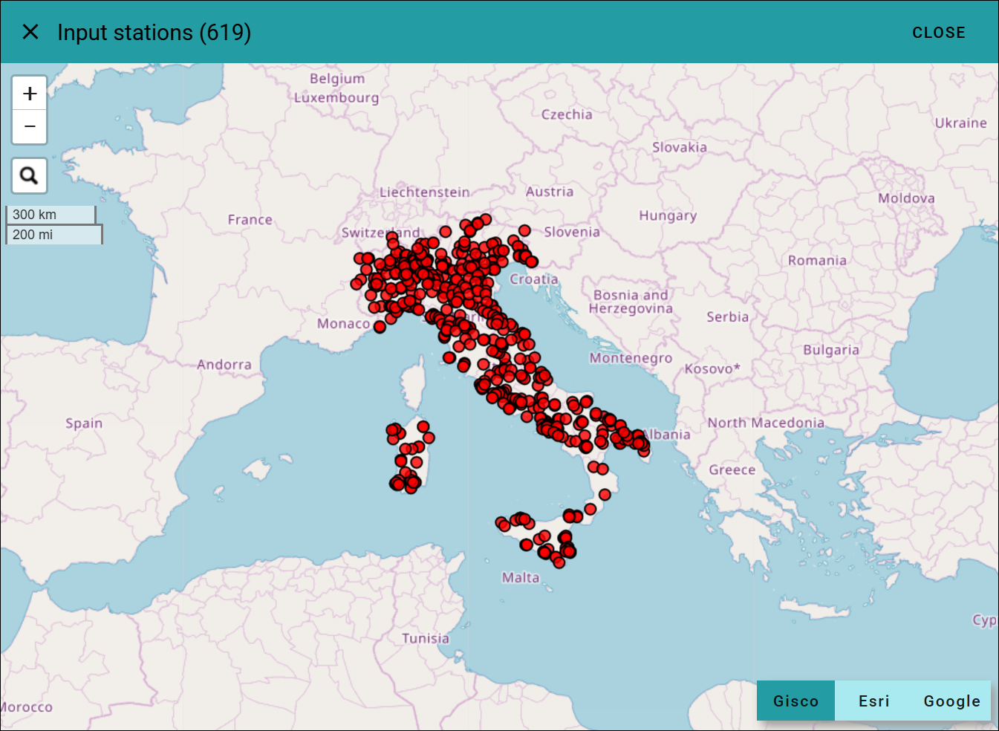
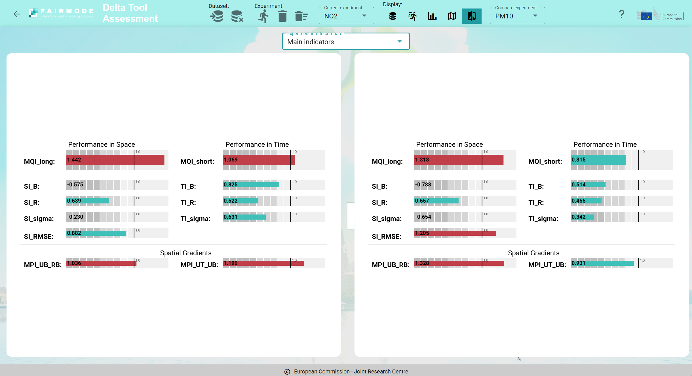
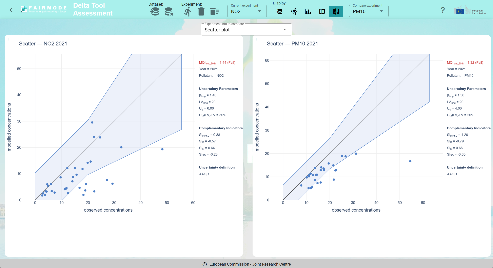
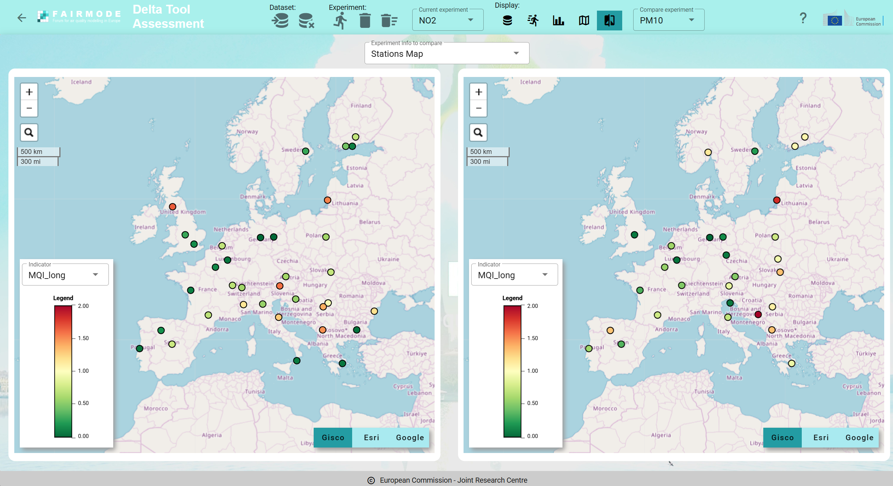

Assessment
==========

FAIRMODE's DeltaTool-Assessment is a Python tool for evaluating air-quality model results against monitoring observations using the FAIRMODE Modelling Quality Objective (MQO) framework. Its core purpose is to answer a regulatory question: is a model good enough to be used for air-quality assessment under the Ambient Air Quality Directive?
To do this it computes, per pollutant and station network, the Modelling Quality Indicator (MQI) — which compares the model–observation difference against a benchmark built from the measurement uncertainty — for both short-term and long-term (annual) metrics, together with the supporting Target Indicators (bias, correlation, standard deviation in time) and Spatial Indicators (the same, but across the annual-mean field over stations). A model "passes" when its 90th-percentile MQI across stations stays at or below 1. The tool is a porting of the Delta-Tool-Light, with elements also from the MQOR.

Users can upload a single dataset into the tool server storage. Once a dataset is loaded, they can run one or more experiments on the same dataset (for instance one experiment per pollutant, or more experiments on the same pollutant by changing the input parameters, etc.). When a new dataset is loaded, the old one is removed.

.. important::

      Please keep in mind that your uploaded dataset will be automatically deleted after ten (10) days of inactivity. Delta Tool Online should not be considered as a long term storage system: keep you stations data safely stored in your local storage, upload them to the tool, run your experiments and download the results as tables and charts.
      

.. toctree::
   :maxdepth: 3
   
Load your dataset
-----------------

Delta Tool Online enables the users to upload their own datasets containing stations and air quality monitoring data. The accepted formats are the **Delta Tool Legacy format** (startup.ini file and two CSV files for each station, one for the observations and one for the model), and the **MQOR format**.

The **Delta Tool legacy format** is described in detail in the `Assessment inputs section <fmm_assess/TECH_SPEC_fmm_assess.html#inputs>`_.

.. warning::

    Although the underlying **fmm_assess** library supports both CSV and NetCDF format for stations data, currently only the CSV version of the format is supported by the Delta Tool Online.
    
The **MQOR format** is described in the `MQOR main repository <https://code.europa.eu/jrcairqualitymodelling/mqor>`_.

Load the sample dataset
^^^^^^^^^^^^^^^^^^^^^^^

The simplest way to start using the Delta Tool Online is to click the "Load sample dataset" button in the Dataset upload dialog-box (see screenshot on the following chapter). This function loads, inside the user storage space, a simple dataset consisting of around 50 stations covering all european countries. After the loading, a download of the dataset can be useful to better understand the correct input format for guiding the uploading of your own dataset. Please refer to the :ref:`Stations toolbar` section to see how to download your current dataset.

Load a dataset in the Delta Tool legacy format
^^^^^^^^^^^^^^^^^^^^^^^^^^^^^^^^^^^^^^^^^^^^^^

To upload a dataset in the Delta Tool legacy format, the user must select, from its local machine, the startup.ini file and two .zip archives: the first containing one CSV for each station for the observation data, and the second containing one CSV for each station for the model data. 

.. note::

    The two .zip archives containing CSV files will be exploded in "flat" mode, meaning that all files are extracted in the same folder on the server storage. This means that the directory structure inside the .zip archive is not taken into consideration.
    

.. figure:: graphics/LoadDatasetDT.png

   Load dataset using the legacy Delta Tool format

Load a dataset in the MQOR format
^^^^^^^^^^^^^^^^^^^^^^^^^^^^^^^^^

To upload a dataset in the MQOR format, the user must select, from its local machine, two .zip archives: the first .zip archive must contain a single CSV file with the attributes data (i.e. the stations info, analogous to the startup.ini file for the Delta Tool legacy format), the second .zip archive must contain a single CSV file with all the short term observation and model values for all the stations.

.. figure:: graphics/LoadDatasetMQOR.png

   Load dataset using the MQOR format

After the loading
^^^^^^^^^^^^^^^^^

As soon as the input files are selected and transferred to the server storage, the Delta Tool Online application performs some consistency checks on the uploaded data, trying to detect possible errors and inconsistencies in the data.

.. figure:: graphics/ConsistencyChecks.png

   Consistency checks on the uploaded dataset

In case some inconsistencies are detected, they are shown to the user in a dedicated window, otherwise the loaded dataset display is activated at the end of the checks. Typical inconsistencies are:

- syntax errors detected in the startup.ini file

- errors in CSV naming (CSV files should be named 'Station Code'.csv or 'Station Name'.csv)

- missing columns on CSV files (occurring when a pollutant is listed for a station in the startup.ini file, but the correspondant column is not present in the observations or in the model data)

- presence of additional files in the observations or model archives, not linked to stations listed in the startup.ini file

If the loading is successfull, the dataset display mode is activated, as shown in the following figure:

.. figure:: graphics/DatasetDisplay.png

   Display of the uploaded dataset
   

To start analysing the content of your dataset and to filter/select the input stations for your experiments, please see :ref:`Dataset summary, stations filtering and selection` chapter where all the available functions (which are common to the assessment and forecasting section of the tool) are listed and explained.

How to use the top bar toolbar
------------------------------

The buttons on the top bar, displayed in the following figure, enable the user to activate all the available functions.

   Buttons of the top bar
   

The buttons are grouped as follows:

Dataset functions
^^^^^^^^^^^^^^^^^

   +-----------------------------------------+-----------------------+
   | Icon                                    | Function              |
   +=========================================+=======================+
   | .. image:: graphics/dataset_load.png    | Load a dataset        |
   +-----------------------------------------+-----------------------+
   | .. image:: graphics/dataset_remove.png  | Remove your dataset   |
   +-----------------------------------------+-----------------------+

Experiment functions
^^^^^^^^^^^^^^^^^^^^

   +--------------------------------------------+-------------------------------+
   | Icon                                       | Function                      |
   +============================================+===============================+
   | .. image:: graphics/experiment_create.png  | Create a new experiment       |
   +--------------------------------------------+-------------------------------+
   | .. image:: graphics/experiment_remove.png  | Remove current experiment     |
   +--------------------------------------------+-------------------------------+
   | .. image:: graphics/experiment_all.png     | Remove all your experiments   |
   +--------------------------------------------+-------------------------------+
   | .. image:: graphics/experiment_select.png  | Select the current experiment |
   +--------------------------------------------+-------------------------------+

Display functions
^^^^^^^^^^^^^^^^^

   +---------------------------------------------+-----------------------------------------------------+
   | Icon                                        | Function                                            |
   +=============================================+=====================================================+
   | .. image:: graphics/display_dataset.png     | Display summary info on the current dataset         |
   +---------------------------------------------+-----------------------------------------------------+
   | .. image:: graphics/display_experiment.png  | Display numerical outputs of the current experiment |
   +---------------------------------------------+-----------------------------------------------------+
   | .. image:: graphics/display_charts.png      | Display plot outputs of the current experiment      |
   +---------------------------------------------+-----------------------------------------------------+
   | .. image:: graphics/display_map.png         | Display stations map of the current experiment      |
   +---------------------------------------------+-----------------------------------------------------+
   | .. image:: graphics/display_compare.png     | Compare current experiment with a second one        |
   +---------------------------------------------+-----------------------------------------------------+
   
   
In some specific cases, at the right of the top bar, new buttons appear, for instance when the display of the charts is activated (to select the zoom level of the charts display among XS-ExtraSmall, S-Small, M-Medium, L-Large, XL-ExtraLarge), or when the compare function is activated (to select the experiment to compare to the current experiment).

Run an experiment
-----------------

The following figure shows the dialog-box that opens when the user cliks on the "Create new experiment" button on the top bar:

.. figure:: graphics/AssessmentRun.png

   Input parameters for running an experiment

The top of this window displays the current filtering and selection status of the stations. It allows you to choose which set of stations to use for the new experiment: either the **filtered stations** or the **(yellow) selected stations**. Directly to the right of this selection toggle, you can click the map icon to open a map view, allowing you to verify the exact list of stations included in the experiment.

   Map view of the input stations for the experiment

The **Pollutant** dropdown allows you to select the target pollutant. Whenever you change this selection, the label to the right updates to show the actual number of input stations (i.e., the effective number of filtered or selected stations that have valid data for the chosen pollutant).

The remaining widgets on the page allow you to configure the rest of the experiment's input parameters:

- **Short-term resolution**: hourly, daily, or max daily 8hr mean (depending on the chosen pollutant)

- **Long-term resolution**: annual or seasonal (depending on the chosen pollutant)

- **Measurement type**: fixed or indicative

- **Uncertainty definition**: at the moment, only aaqd is available

- **Minimum data capture percentage**

- **Minimum number of stations**

Once you enter a name for the experiment, the **OK** button becomes active, allowing you to start the calculation. At this point the underlying fmm_assess Python library is called and in few minutes, depending on the number of input stations, the results will be produced.

In case the calculation generates errors, the full log is displayed in an overlapping window, otherwise the display of the numerical outputs of the experiment is activated.

Analyse experiment results
--------------------------

After a run terminates successfully, the system generates both numerical and graphical outputs, as detailed in the `Output section <fmm_assess/TECH_SPEC_fmm_assess.html#outputs>`_, which lists all results produced by the fmm_assess library. To assist with analysis, the Delta Tool Online application provides several visualization and comparison tools, which are described in the following chapters.

Numerical results
^^^^^^^^^^^^^^^^^

By clicking the "Display numerical outputs of the current experiment" button in the Display section of the top bar (see :ref:`Display functions`):

the main numerical outputs of the currently selected experiment are displayed:

.. figure:: graphics/AssessmentNumeric.png

   Numerical results of an assessment experiment

The top section of this page summarizes the input parameters selected to start the experiment (reflecting all the choices made on the :ref:`Run an experiment` page). Immediately to the right, three buttons allow for the download of the experiment result, respectively: download all the tabular outputs, download all the charts images, download both tabular and chart outputs:

Directly below the top of the screen, the main indicators are displayed using a graphical layout, with red and green color coding to represent the success or failure of their respective thresholds, together with the temporal coherence summary (see  `Temporal-coherence MPIs (3x3 grid) <fmm_assess/INDICATORS.html#temporal-coherence-mpis-3x3-grid>`_).

Two tabular representations are present in the page. On the top-right side of the page, the log messages collected from the fmm_asses library execution are displayed, allowing for detailed check of the correct execution of the calculations (stations exclusions and other log messages will be presented in this table). The lower part of the screen shows the full table of the indicators calculated for each of the input stations.

Charts outputs
^^^^^^^^^^^^^^

By clicking the "Display plot outputs of the current experiment" button in the Display section of the top bar (see :ref:`Display functions`):

the chart outputs of the currently selected experiment are displayed:

.. figure:: graphics/AssessmentCharts.png

   Graphical outputs of an assessment experiment

All charts are interactive; hovering the cursor over the chart content displays additional detailed information. You can also zoom in on or download the charts using the tools in the toolbar that appears at the top right of each chart.

Additionally, you can adjust the overall display size of the charts by selecting a zoom factor, XS (Extra Small), S (Small), M (Medium), L (Large), or XL (Extra Large), from the application's top bar.

For a detailed description of each chart's content, please refer to the `Diagrams chapter <fmm_assess/TECH_SPEC_fmm_assess.html#diagrams-plots>`_ in the fmm_assess documentation. For tips on how to interpret and analyse the graphical outputs, see the `Plots reading guide <fmm_assess/PLOTS.html#plots-reading-guide>`_.

Map output
^^^^^^^^^^

By clicking the "Display stations map of the current experiment" button in the Display section of the top bar (see :ref:`Display functions`):

a map windows is opened that allows for geographical display of the stations, with colors defined by each of the calculated indicators:

.. figure:: graphics/AssessmentMap.png

   Map visualization of output indicators per station
   
On the lower-left side of the map, you can select which indicator to visualize. The corresponding color legend is displayed immediately below this selection. Clicking on any station displays its specific indicator value.

.. note::

    For indicators with an acceptance threshold of 1.0 (such as MQI_long, MQI_short, and the temporal or spatial indicators), the map uses a diverging color palette centered at 1.0 that transitions from green to red. For all other indicators, a Viridis palette is used, with color intervals scaled across the range from -2 to +2 standard deviations from the average ([average - 2*std.dev, average + 2*std.dev]).
    
    
Compare two experiments
-----------------------

When more than one experiment has been calculated, the "Compare current experiment with a second one" button becomes active on the application's top bar.

Clicking this button reveals a selection menu on the right side of the top bar, allowing you to choose which experiment to compare against the currently active one. The main window then updates to let you select which specific output component of the two experiments to compare side by side.

The following components are available for comparison:

- **Input parameters**: displays a side-by-side list of the parameters used to run each experiment

- **Main indicators**: shows the primary numerical indicators for both experiments

- **Temporal coherence summary**: displays the 3x3 coherence matrix comparison

- **Radar plot**

- **Target plot**

- **Taylor plot**

- **Bars plot**

- **Scatter plot**

- **Scatter dyneval plot**

- **TS report**

- **Stations Map**: displays the stations on two adjacent maps whose zoom and pan actions are synchronized

The figures below show examples of comparisons for the main indicators, the scatter plot, and the stations map, respectively:

   Comparison of the main indicators

   Comparison of the scatter charts

   Comparison of the stations map

