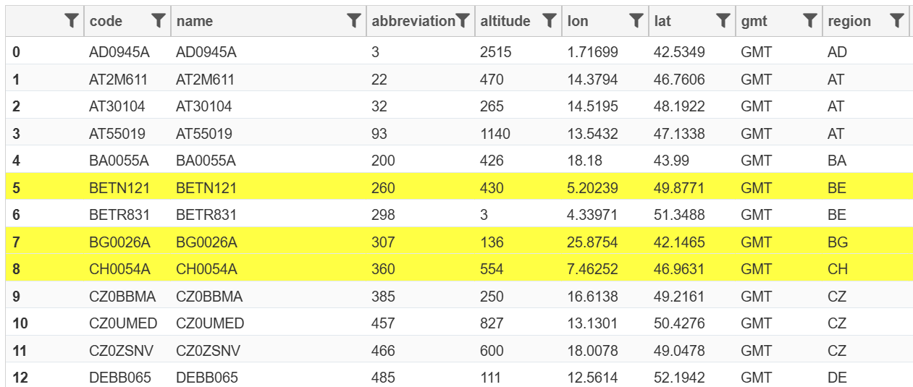
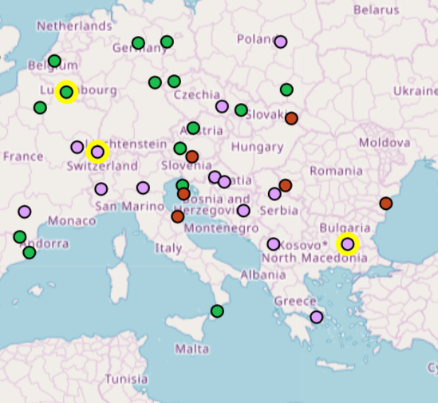

Dataset summary, stations filtering and selection
=================================================

.. toctree::
   :maxdepth: 3

This section explains how to interact with the dataset display page to analyse the dataset content and to filter and select the input stations for an experiment. The functions available are exactly the same both for assessment and forecasting experiments.

Stations are displayed on a table and on a map and the two views are always linked.

Summary panel
-------------

.. figure:: graphics/summary_panel.png
   :width: 500px
   :align: center

   Summary panel showing stations type and area info

The top-right section of the "Dataset Summary" page displays information about the loaded dataset's content, including its storage size and the total, filtered, and selected number of stations.

.. note::

    The "Dataset Summary" page allows you to browse the dataset and decide which stations to include in your experiments. You can do this using two distinct subsetting mechanisms: stations can be **filtered** using their alphanumeric attributes (the columns displayed in the stations table), and/or they can be **(yellow) selected** by clicking on rows in the stations table or on station points on the map. These operations are described in more detail in the :ref:`Stations table` and :ref:`Stations map` sections. The window for configuring experiment parameters clearly displays the current number of filtered and (yellow) selected stations, allowing you to choose which subset to use as the input for your experiment (see the :ref:`Run an experiment` page for reference).

The summary panel also shows the date and time the dataset was loaded and last modified (for example, when an experiment is executed or removed). The two animated pie charts below are linked to the stations table and the stations map; they graphically visualize the distribution of stations by **Type** (background, industrial, traffic) and by **Area** (urban, suburban, rural).

Finally, the bottom part of the summary panel displays the number of stations for each pollutant defined in the dataset's **startup.ini** file. Like the pie charts, this section is dynamically updated by the filtering mechanism.

Stations toolbar
----------------

.. figure:: graphics/stations_toolbar.png

   Toolbar containing functions to interact with the list of stations

The function of the stations toolbar are:

   +--------------------------------------------+--------------------------------------------------------+
   | Icon                                       | Function                                               |
   +============================================+========================================================+
   | .. image:: graphics/filter_reset.png       | Reset all stations filters based on table columns      |
   +--------------------------------------------+--------------------------------------------------------+
   | .. image:: graphics/selection_reset.png    | Reset stations (yellow) selection                      |
   +--------------------------------------------+--------------------------------------------------------+
   | .. image:: graphics/timeseries_display.png | Display timeseries of the (yellow) selected stations   |
   +--------------------------------------------+--------------------------------------------------------+
   | .. image:: graphics/dataset_download.png   | Download the curret dataset as a .zip archive          |
   +--------------------------------------------+--------------------------------------------------------+

The button to display the timeseries is active only when a "yellow selection" is active (meaning one or more stations have been selected by clicking on the stations table or map). When clicked, it opens an overlay window that displays the full timeseries of both observed and modeled data for all currently selected stations.

.. figure:: graphics/timeseries.png

   Display of observed and modeled values for two stations
   

Each station is assigned a unique color; the observed data is shown in this color, while the corresponding model dataset is displayed in a darker shade of the same color. Hovering the cursor over the chart displays the specific observed and modeled values for that date and time.

Clicking or double-clicking items in the chart legend (located at the top right) allows you to hide or show individual data series. This is a standard feature of Plotly charts (for details, see the `Plotly legends documentation <https://plotly.com/python/legend/>`_).

Stations table
--------------

The following figure displays a table containing the stations with their associated attribute columns:

.. figure:: graphics/stations_table.png

   Stations table

Stations filtering
^^^^^^^^^^^^^^^^^^

Each column in the table features a filter icon to the right of its name. Clicking this icon allows you to filter stations by selecting individual column values or defining specific numeric ranges. For example, you can easily filter the dataset to display only a specific station type (such as background stations), stations measuring a specific pollutant, or stations above a certain altitude threshold.

The figure below illustrates how to create a filter by station type, which is useful when preparing an experiment that requires only background stations as input:

.. figure:: graphics/filter_by_type.png
   :width: 400px
   :align: center

   Filter the stations to keep only those in background areas

The filtering mechanism temporarily hides stations that do not satisfy the active criteria. Clicking the "Reset all stations filters based on table columns" button in the :ref:`Stations toolbar` toolbar clears all filters and restores the full dataset display.

.. note::

   Please note that when multiple filters are applied simultaneously, they are combined using a logical **AND** operation. This means only stations that satisfy **all** active filters will remain visible in the table.

In addition to the standard 13 columns defined in the startup.ini format - note that the optional 13th column can specify a **fixed/indicative** flag at the station level, as described in the `startup.ini chapter of the fmm_assess documentation <fmm_assess/TECH_SPEC_fmm_assess.html#startup-ini>`_ — the system performs a **spatial join** during dataset loading. This joins station locations with European NUTS administrative levels (NUTS0 = country, NUTS1 = macroregion, NUTS2 = region, and NUTS3 = province). Scrolling to the right of the stations table reveals the NUTS regions to which each station belongs. This spatial join enables you to easily filter stations within a specific administrative boundary to run experiments on localized geographic areas.

Stations (yellow) selection
^^^^^^^^^^^^^^^^^^^^^^^^^^^

The **(yellow) selection** is a separate, distinct mechanism for subsetting stations. It can be used either to isolate data for the timeseries display (as detailed in the :ref:`Stations toolbar` section) or as an alternative method for choosing input stations for a new experiment (see the :ref:`Run an experiment` page for details on toggling between filtered or selected stations).

You can **(yellow) select** a station by clicking its row in the Stations Table. Holding the **Shift** or **Ctrl** keys enables multi-row selection. This selection mechanism is also fully integrated with the Stations Map, as described in the next section.

   Yellow selection on the stations table

Stations map
------------

The visualization of station positions on the map is dynamically linked to the Stations table. Any **filtering** or **(yellow) selection** applied in the table is immediately reflected on the map, and vice versa. You can change the background map by clicking the buttons on the lower-right side of the map to select from the "Gisco", "Esri", or "Google" basemaps.

.. figure:: graphics/stations_map.png

   Stations map

In the lower-left corner of the map, you can toggle between two legends to change how stations are represented:

- Display stations colored by station_type

.. image:: graphics/legend_by_type.png
   :width: 45%
   :align: center

- Display stations colored by station_area

.. image:: graphics/legend_by_area.png
   :width: 45%
   :align: center

   Display stations by applying different colors according to their station_area (urban, suburban, rural)

To select multiple stations directly on the map, simply hold down the **Shift*+ key on your keyboard while clicking on the stations.

   Yellow selection on the stations map
