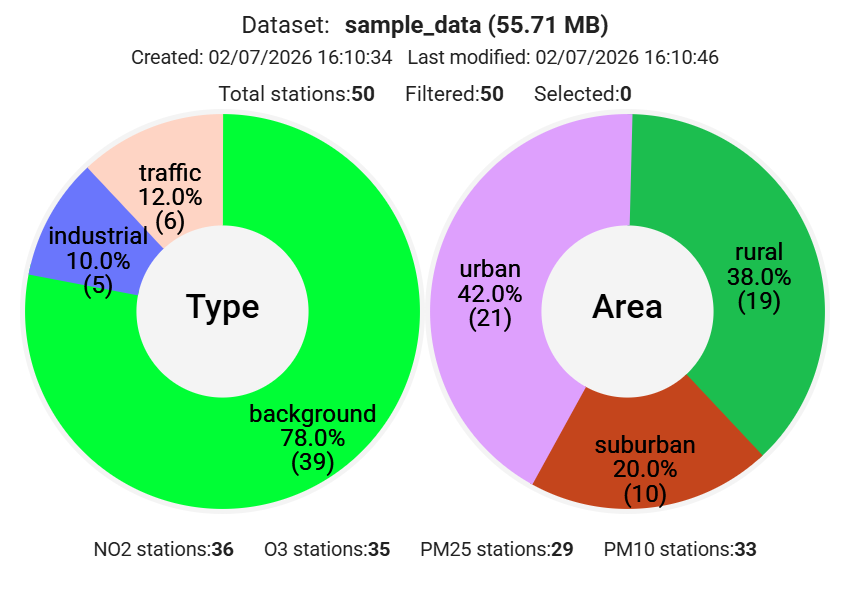
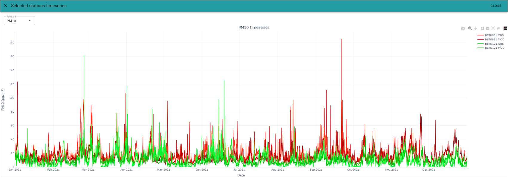
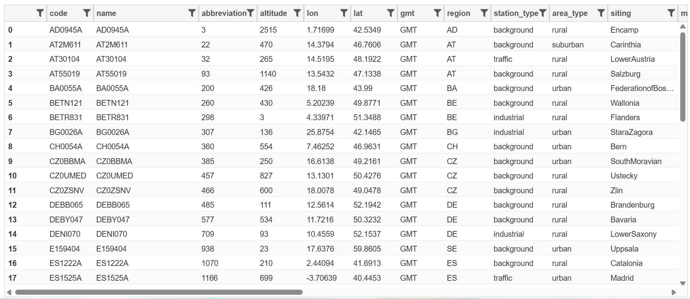
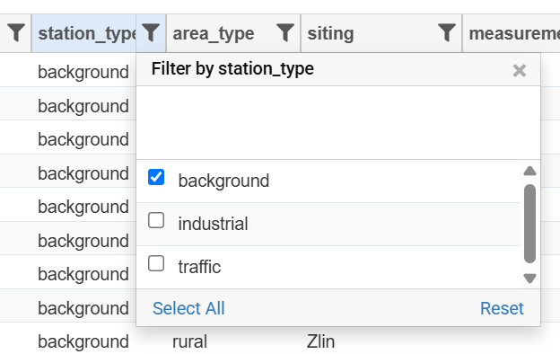
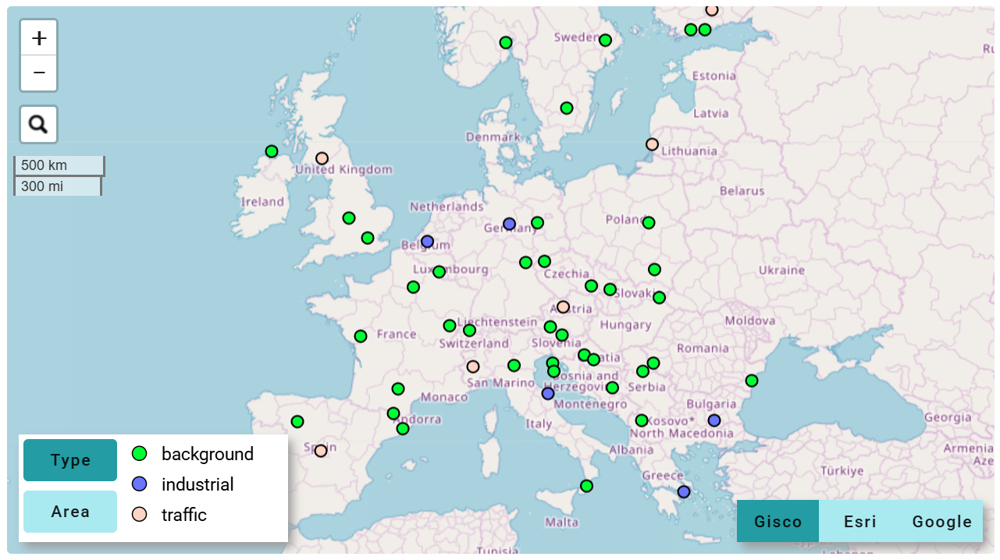
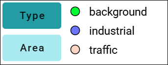
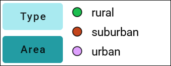

Dataset summary, stations filtering and selection
=================================================

.. toctree::
   :maxdepth: 3

This section explains how to interact with the dataset display page to analyse the dataset content and to filter and select the input stations for an experiment. The functions available are exactly the same both for assessment and forecasting experiments.

Stations are displayed on a table and on a map and the two views are always linked.

Summary panel
-------------

   Summary panel showing stations type and area info

The top-right section of the "Dataset Summary" page displays information about the loaded dataset's content, including its storage size and the total, filtered, and selected number of stations.

.. note::

    The "Dataset Summary" page allows you to browse the dataset and decide which stations to include in your experiments. You can do this using two distinct subsetting mechanisms: stations can be **filtered** using their alphanumeric attributes (the columns displayed in the stations table), and/or they can be **(yellow) selected** by clicking on rows in the stations table or on station points on the map. These operations are described in more detail in the :ref:`Stations table` and :ref:`Stations map` sections. The window for configuring experiment parameters clearly displays the current number of filtered and (yellow) selected stations, allowing you to choose which subset to use as the input for your experiment (see the :ref:`Run an experiment` page for reference).

The summary panel also shows the date and time the dataset was loaded and last modified (for example, when an experiment is executed or removed). The two animated pie charts below are linked to the stations table and the stations map; they graphically visualize the distribution of stations by **Type** (background, industrial, traffic) and by **Area** (urban, suburban, rural).

Finally, the bottom part of the summary panel displays the number of stations for each pollutant defined in the dataset's **startup.ini** file. Like the pie charts, this section is dynamically updated by the filtering mechanism.

Stations toolbar
----------------

   Toolbar containing functions to interact with the list of stations

The function of the stations toolbar are:

   +--------------------------------------------+--------------------------------------------------------+
   | Icon                                       | Function                                               |
   +============================================+========================================================+
   | .. image:: graphics/filter_reset.png       | Reset all stations filters based on table columns      |
   +--------------------------------------------+--------------------------------------------------------+
   | .. image:: graphics/selection_reset.png    | Reset stations (yellow) selection                      |
   +--------------------------------------------+--------------------------------------------------------+
   | .. image:: graphics/timeseries_display.png | Display timeseries of the (yellow) selected stations   |
   +--------------------------------------------+--------------------------------------------------------+
   | .. image:: graphics/dataset_download.png   | Download the curret dataset as a .zip archive          |
   +--------------------------------------------+--------------------------------------------------------+

The button to display the timeseries is active only when there is a non-empty yellow selection (one or more stations selected in yellow by clicking on the stations table or on the stations map). When clicked, it opens an overlapped window that displays the full timeseries of all the (yellow) selected stations, for both observed and model data.

   Display of observed and modeled values for two stations
   

Each station is represented with a different color, while the modeled dataset of the same station is represented by a darker version of the same color. By moving the mouse inside the chart, observed and modeled data are displayed for a specific date/time.

By clicking and double-clicking on the chart legend, displayed on the top-right side of the chart, it is also possible to hide and show single data series (standard function in Plotly charts, see `Plotly legends documentation <https://plotly.com/python/legend/>`_).

Stations table
--------------

The following figure displays a table containing the stations with their associated attribute columns:

   Stations table

Stations filtering
^^^^^^^^^^^^^^^^^^

For each column of the table, a filter icon is present on the right of the column name: if clicked, it allows for station **filtering** by choosing individual column values or specific ranges for numerical values. As an example, these filtering icons can easily allow the user to filter all stations of a specific type (for instance only the background stations), or only the stations where a specific pollutant is observed, or even the stations whose altitude above the see level is greated that a threshold. 

The detail in the following figure shows the creation of a filter on the stations type, in preparation of an experiment that will take as input only the background stations of the dataset:

   Filter the stations to keep only those in background areas

The filtering mechanism temporarily removes the stations that do non satisfy the filter. By clicking on the "Reset all stations filters based on table columns" button in the :ref:`Stations toolbar` removes all the filters and restores the full display of all the stations of the dataset.

.. note::

   Please note that, if more that one filter is inserted, the logical operation used is the **AND**. This means that only the stations that satisfy **all** the filters are kept in the table.

Beside the standard 13 columns present in the startup.ini data format (please note that the 13th optional column can contain the **fixed/indicative** flag at station level, as described in the `startup.ini chapter of the fmm_assess documentation <fmm_assess/TECH_SPEC_fmm_assess.html#startup-ini>`_), the dataset loading performs a **spatial join** of the stations points with the **NUTS administrative levels** at european level (NUTS0=country, NUTS1=Macroregions, NUTS3=Regions and NUTS3=Provinces). Scrolling on the right the stations table, the NUTS to which each of the station belongs will be visible on the table. This join is done to allow users to easily filter all the stations that fall inside a specific NUTS for running an experiment on the stations of a restricted geographic area.

Stations (yellow) selection
^^^^^^^^^^^^^^^^^^^^^^^^^^^

The **(yellow) selection** is a second, and distinct, mechanism to subset the stations and can be used both for the timeseries display (as described in the previous :ref:`Stations toolbar` chapter), or as an alternative way to choose stations to give as input to a new experiment (see :ref:`Run an experiment` page for reference on how it is possible to decide if the filtering or the (yellow) selection is used to subset the input stations for an experiment).

By clicking the rows of the Stations Table, the (yellow) selection is activated. Using the **"Shift"** and **"Ctrl"** keyboard keys, enables the multiple selection of station rows. This selection operation is available also on the Stations Map, as described in the following chapter.

Stations map
------------

   Stations map

   Display stations by applying different colors according to their station_type (backgroiund, industrial, traffic)

   Display stations by applying different colors according to their station_area (urban, suburban, rural)
