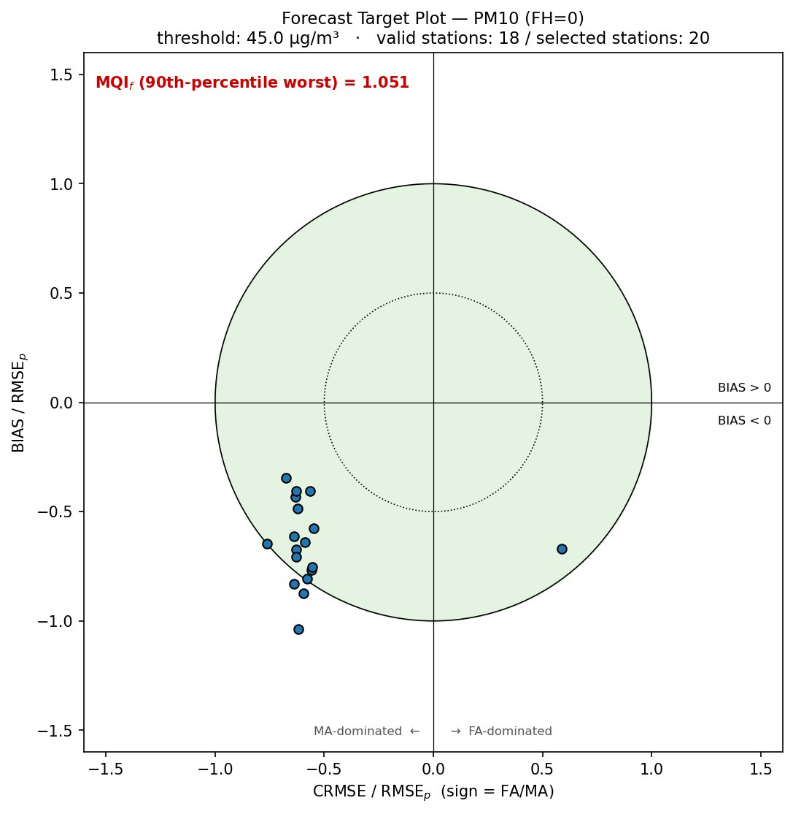
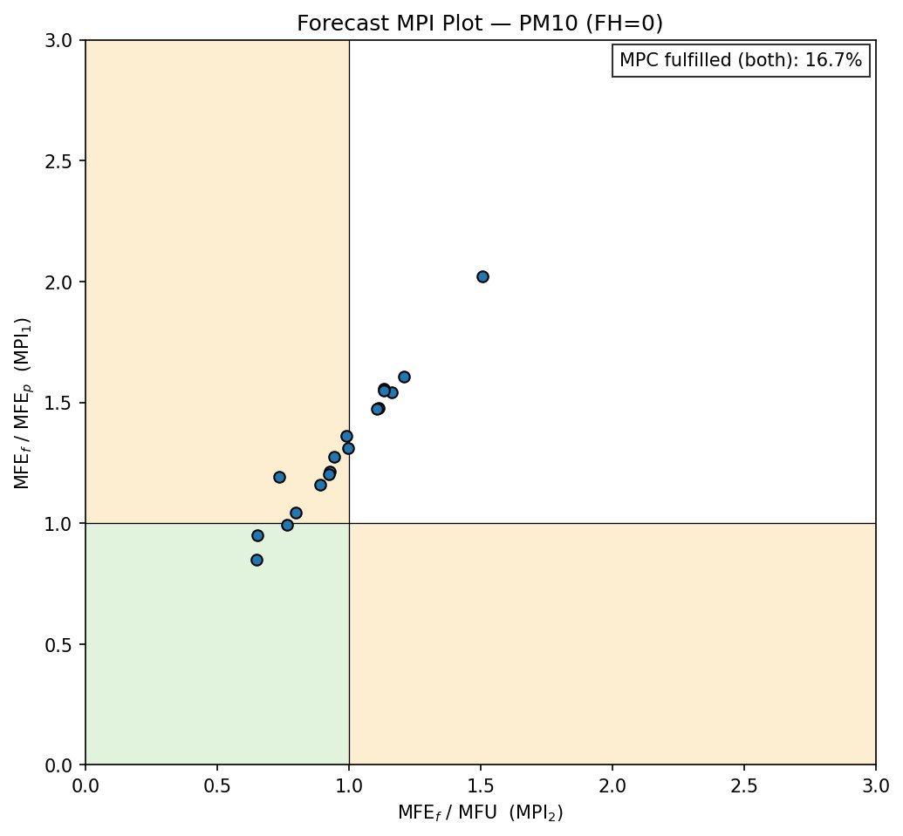
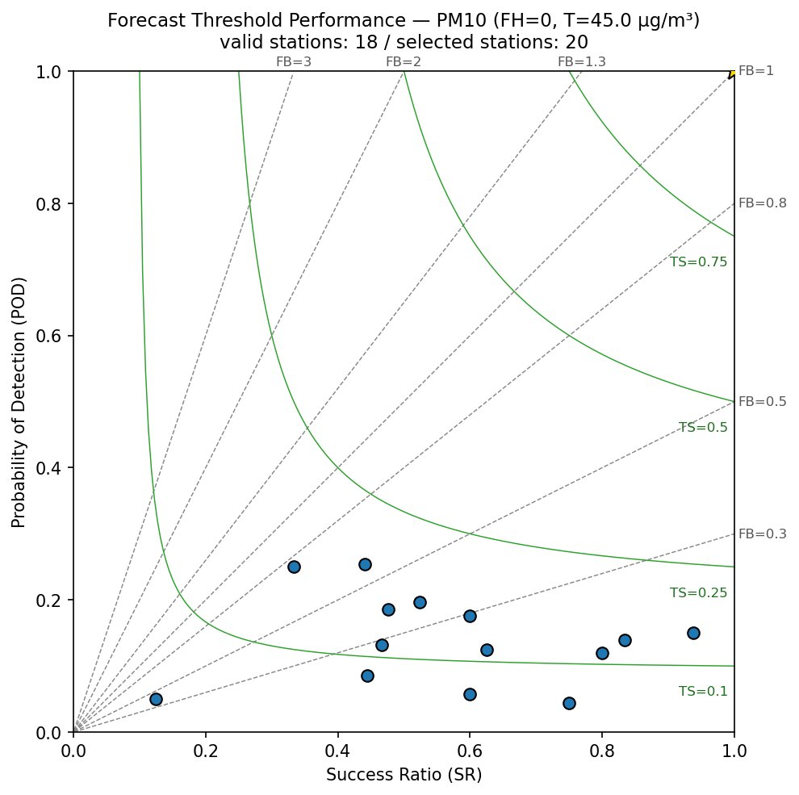
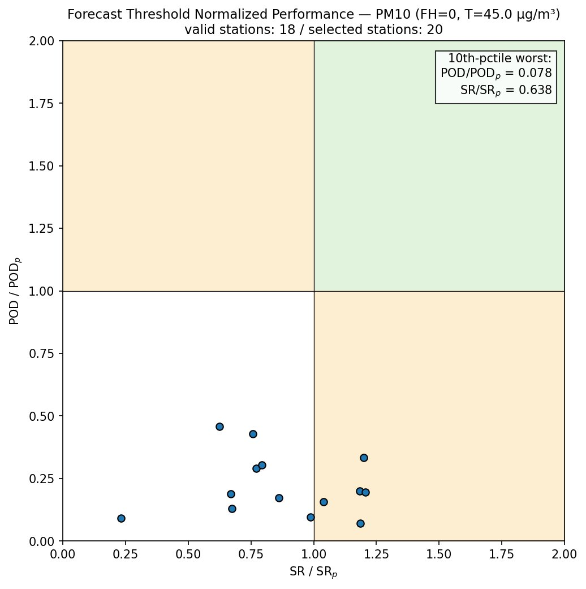
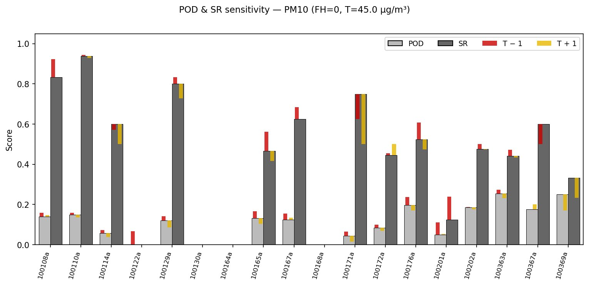
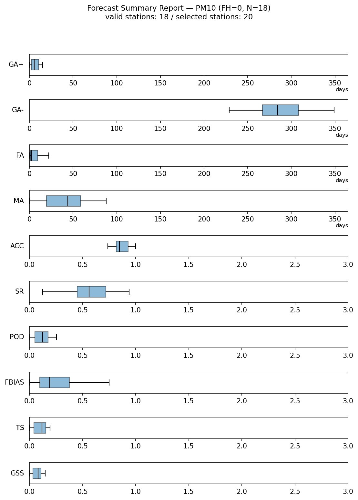
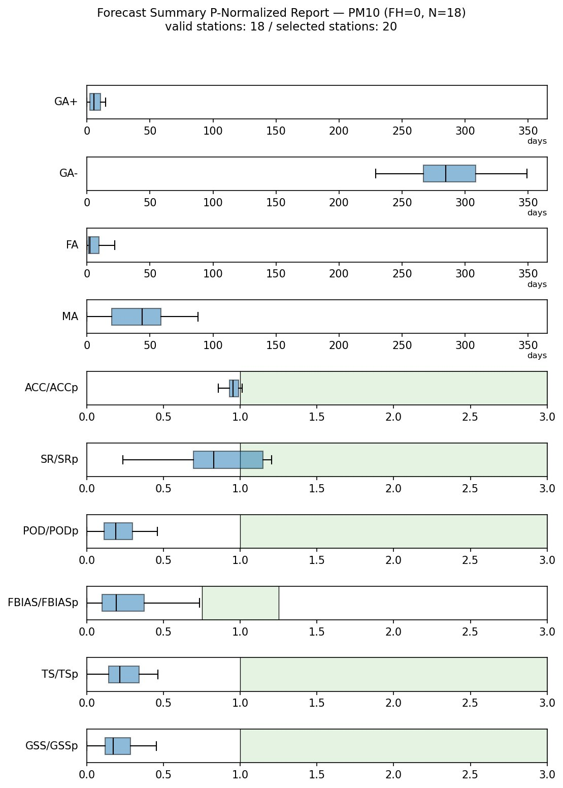
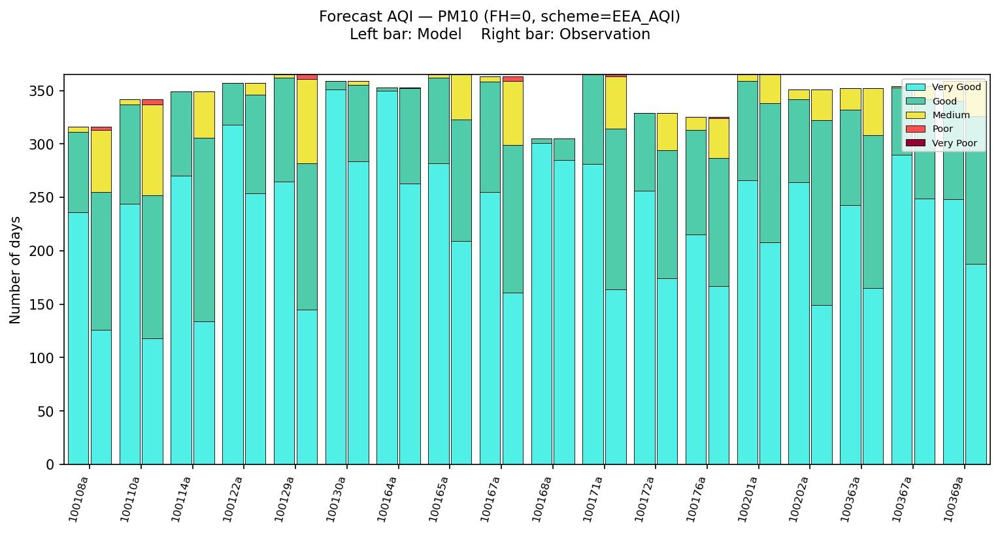

# Plots reading guide

`fmf_eval` produces **eight diagnostic diagrams** per run × forecast
horizon, each in two backends:

- **matplotlib** — static PNG under `out/mplotl/` (PDF optional)
- **plotly** — interactive HTML under `out/pltly/` (hover tooltips,
  zoom, pan)

The numerical content is **bit-identical** between the two backends:
same indicators, same dot positions, same pass/fail colouring. The
difference is interactivity, not data. Filenames below show the PNG;
the HTML equivalent has the same name with `.html`.

## Contents

- [Triage workflow](#triage-workflow)
- [forecast_target_FH⟨n⟩.png — Forecast Target plot](#forecast_target_fhnpng--forecast-target-plot)
- [forecast_mpi_FH⟨n⟩.png — Forecast MPI plot](#forecast_mpi_fhnpng--forecast-mpi-plot)
- [forecast_threshold_perf_FH⟨n⟩.png — Forecast Threshold Performance plot](#forecast_threshold_perf_fhnpng--forecast-threshold-performance-plot)
- [forecast_threshold_perf_norm_FH⟨n⟩.png — Forecast Threshold Normalised Performance plot](#forecast_threshold_perf_norm_fhnpng--forecast-threshold-normalised-performance-plot)
- [forecast_pod_sr_sensitivity_FH⟨n⟩.png — POD / SR sensitivity bar plot](#forecast_pod_sr_sensitivity_fhnpng--pod--sr-sensitivity-bar-plot)
- [forecast_summary_FH⟨n⟩.png — Forecast Summary Report](#forecast_summary_fhnpng--forecast-summary-report)
- [forecast_summary_pnorm_FH⟨n⟩.png — Forecast Summary P-Normalised Report](#forecast_summary_pnorm_fhnpng--forecast-summary-p-normalised-report)
- [forecast_aqi_FH⟨n⟩.png — Forecast AQI plot](#forecast_aqi_fhnpng--forecast-aqi-plot)
- [Backend differences (matplotlib vs plotly)](#backend-differences-matplotlib-vs-plotly)

---

## Triage workflow

**The MQOf fails. What do I look at first?**

1. **`forecast_target_FH<n>.png`** — identifies *what kind* of
   continuous error dominates. Read the position of the dot cloud:
   above/below the x-axis ⇒ bias direction; left/right of the y-axis
   ⇒ miss-dominated vs false-alarm-dominated. The 90th-percentile
   `MQIf` annotation is the headline pass/fail number.

2. **Drill into the failing family**:
   - Dots outside the green disc and **MPC fulfilment low**
     (`forecast_mpi_FH<n>.png`) → both forecast and persistence are
     beaten by measurement uncertainty; investigate `MPI2` first.
   - Dots outside the disc but **MPC fulfilment high** → forecast is
     within measurement noise but worse than persistence. Look at
     `forecast_threshold_perf_norm_FH<n>.png` to see whether the
     categorical side tells the same story.
   - **All stations under-predict** (lower half of Target plot, low
     `FBIAS` in Fig. 7) → systematic forecast-emission or chemistry
     issue.

3. **`forecast_threshold_perf_FH<n>.png`** — for exceedance-focused
   diagnostics. Distance from the gold star is the categorical
   "quality"; FB and TS isolines diagnose the bias direction and
   threat-score level.

4. **`forecast_pod_sr_sensitivity_FH<n>.png`** — check whether the
   categorical scores are **robust** to small threshold perturbations.
   Wide red/yellow overlay spreads ⇒ the score is fragile, don't
   over-interpret it.

5. **`forecast_summary_FH<n>.png`** + **`forecast_summary_pnorm_FH<n>.png`** —
   network-wide distribution of all ten indicators. Tight clusters on
   the right side mean strong consistent performance; wide spreads or
   clusters near zero flag problem areas.

6. **`forecast_aqi_FH<n>.png`** — distributional check on the AQI
   categories. Useful for "the public-facing index" view, but pair it
   with the categorical scores above for matched-day accuracy.

7. **CSV outputs** — `indicators_per_station_FH<n>.csv` for the
   row-by-row numbers behind every dot you see in the plots.

---

## forecast_target_FH⟨n⟩.png — Forecast Target plot

**Reference**: JRC146007 §2.1, Fig. 2.

**Example (PM10, FH=0).**

### What it shows

One dot per station in a normalised "target" plane. Axes:

- **x = `CRMSE / RMSE_p`** with sign — **positive** if
  false-alarm-dominated (`FA > MA`), **negative** if miss-dominated.
  Strict `>` is used (matching the IDL); `FA == MA` lands on the
  negative side.
- **y = `BIAS / RMSE_p`** — positive when the forecast over-predicts
  on average.

The **green disc of radius 1** is the MQOf-fulfilment area: any
station inside has `MQIf < 1`. The **dotted inner half-circle of
radius 0.5** is a tighter "very good" guide.

### Side panel

- The **90th-percentile-worst `MQIf`** in the top-left corner —
  **green if `< 1`** (MQOf likely fulfilled), **red if `≥ 1`**.
- The considered **threshold** in µg/m³.
- The count of **valid / selected stations**.

### How to read

- **Cluster inside the green disc, near the centre** → forecast doing
  well, no obvious bias direction.
- **Points pushed up / down** → consistent over- / under-prediction.
- **Points on the right / left** → FA- / MA-dominated errors. Right
  ⇒ "crying wolf" more than missing; left ⇒ the opposite.
- **Points outside the disc** → that station does worse than
  persistence (= MQIf ≥ 1).

**Reading the example.** The 90th-percentile-worst MQIf is
**1.051 (red)** ⇒ MQOf not fulfilled at the worst-decile. The point
cloud sits entirely in the lower-left half of the green disc — the
network is consistently **under-predicting** and **miss-dominated**.

---

## forecast_mpi_FH⟨n⟩.png — Forecast MPI plot

**Reference**: JRC146007 §2.2, Fig. 3.

**Example (PM10, FH=0).**

### What it shows

One dot per station with coordinates (`MPI2`, `MPI1`). The plane is
divided into three coloured zones:

- **Green** lower-left quadrant `[0,1] × [0,1]`: both `MPI1` and
  `MPI2` are below 1 → forecast better than persistence **and** within
  measurement uncertainty (MPC fulfilled).
- **Orange** upper-left and lower-right strips: only one of the two
  criteria is met.
- **White** upper-right: neither is met.

### Side panel

- The **network-level MPC fulfilment percentage** (fraction of
  stations in the green quadrant).
- The count of **valid / selected stations**.

### How to read

- All points ideally in the green quadrant.
- Points in the **upper-left** strip (`MPI1 > 1`, `MPI2 < 1`) → the
  forecast is within measurement noise but loses to persistence. Often
  flat or trivially-low-bias forecasts.
- Points in the **lower-right** strip (`MPI1 < 1`, `MPI2 > 1`) →
  beats persistence but is bigger than the measurement noise floor.

**Reading the example.** MPC fulfilment is only **16.7 %**. Two
stations fall in the green quadrant; the rest cluster between
`MPI2 ≈ 1` and `MPI1 ≈ 1–2`, mostly in the orange "`MPI1 > 1` only"
strip — forecast within measurement noise but worse than persistence.

---

## forecast_threshold_perf_FH⟨n⟩.png — Forecast Threshold Performance plot

**Reference**: JRC146007 §2.3, Fig. 4.

**Example (PM10, FH=0, T=45 µg/m³).**

### What it shows

A "performance diagram" in (`SR`, `POD`) space, one dot per station,
with two families of reference curves:

- **Dashed grey FBIAS isolines** `POD = FBIAS · SR` — straight lines
  through the origin. Stations on the `FB = 1` diagonal have unbiased
  exceedance counts; above ⇒ over-predicting, below ⇒ under-predicting.
  Colour: line `#888888`, labels `#555555`.
- **Solid green TS isolines** `1/POD = 1/SR + 1/TS − 1` — curves of
  constant Threat Score. Labels at `TS = 0.1, 0.25, 0.5, 0.75`.
  Colour: line `#2ca02c`, labels `#1f6f1f`.

The perfect-forecast point is marked with a **gold star at (1, 1)**.

### Side panel

Subtitle reports the considered threshold and the count of valid /
selected stations.

> **Plotly-specific note.** The FB labels at the right/top edges use
> `xref="paper"` / `yref="paper"` anchoring so they don't get clipped
> by the axis range.

### How to read

- Each station's *distance from the gold star* is its overall
  categorical performance.
- The **FB isoline** through the point tells you the bias direction of
  its exceedance counts.
- The **TS isoline** through the point tells you the threat-score
  level.

**Reading the example.** Stations cluster in the low-POD /
mid-to-high-SR region (POD ≈ 0.05–0.25, SR ≈ 0.3–0.95). TS ≤ 0.25
across the board; many below TS = 0.1. Reading FB: most lie between
0.3 and 1 ⇒ **systematic under-prediction** of exceedance counts.
None near the gold star.

---

## forecast_threshold_perf_norm_FH⟨n⟩.png — Forecast Threshold Normalised Performance plot

**Reference**: JRC146007 §2.3, Fig. 5.

**Example (PM10, FH=0, T=45 µg/m³).**

### What it shows

Same idea as Fig. 4 but each station's coordinates are **normalised
by the persistence model**:

- **x = `SR / SR_p`**
- **y = `POD / POD_p`**

The plane is split into four quadrants:

- **Green** upper-right (both ratios > 1): forecast beats persistence
  on *both* sides.
- **Orange** upper-left and lower-right: beats persistence on only
  one side.
- **White** lower-left: persistence is doing better.

### Side panel

The top-right annotation reports the **10th-percentile-worst values**
of `POD/POD_p` and `SR/SR_p` across stations — the level reached by
the worst-decile of stations. Subtitle reports valid / selected
stations.

### How to read

Same as Fig. 4 but with a sharper "compared to persistence" lens —
useful to disqualify model setups that look acceptable in absolute
terms but fail to beat a trivial baseline.

**Reading the example.** Every station's `POD/POD_p` is well below 1
⇒ **forecast loses to persistence on the detection side**. `SR/SR_p`
is more mixed: roughly half the stations beat persistence on SR. No
station is in the green upper-right quadrant. Worst-decile ratios:
`POD/POD_p = 0.078` (very poor), `SR/SR_p = 0.638`.

---

## forecast_pod_sr_sensitivity_FH⟨n⟩.png — POD / SR sensitivity bar plot

**Reference**: JRC146007 §2.4, Fig. 6.

**Example (PM10, FH=0, T=45 µg/m³).**

### What it shows

Per-station bar plot. Each station gets a group of two parent bars
(POD light grey, SR dark grey) plus two thin overlay bars per parent
showing how the score changes when the exceedance threshold is
shifted:

- **Red** (`T − Δ`) — score recomputed at threshold − sensitivity µg/m³.
- **Yellow** (`T + Δ`) — score recomputed at threshold + sensitivity µg/m³.

In the matplotlib backend the overlays sit inside the parent bar's
footprint. In the plotly backend they are drawn as proper `go.Bar`
traces with explicit `width=0.127` and offset
`parent_offset + bar_width/2 ± (sens_width + gap/2)` to land inside
the parent bar.

### Side panel

Subtitle reports the threshold and the count of valid / selected
stations.

### How to read

- **Red / yellow overlays tight on top of the parent bar** → the
  station's POD/SR is **robust** to small threshold perturbations.
- **Wide spread between the red and yellow caps** → the station is
  operating near the exceedance threshold; its categorical score is
  **fragile** and shouldn't be over-interpreted.
- **No bars** at a station → undefined categorical scores at this
  threshold (no exceedances observed or forecast — NaN, not 0).

**Reading the example.** POD bars are uniformly low (≤ 0.25) and the
overlays sit close to the top of each bar ⇒ POD is **robust**. SR
bars span 0–0.95 and several stations show wide red/yellow spreads ⇒
SR is **fragile** there. Stations with no bars (e.g. `100122a`,
`100130a`, `100164a`, `100168a`) have undefined scores at this T.

---

## forecast_summary_FH⟨n⟩.png — Forecast Summary Report

**Reference**: JRC146007 §2.5, Fig. 7.

**Example (PM10, FH=0, N=18 valid out of 20 selected).**

### What it shows

A vertically stacked strip per indicator (ten strips total), each
containing one point per station at the indicator value:

- **Count strips** (`GA+`, `GA−`, `FA`, `MA`): x-axis 0 → 365 days.
- **Rate strips** (`ACC`, `SR`, `POD`, `FBIAS`, `TS`, `GSS`):
  x-axis 0 → 3 (unitless).

**Layout switch by station count:**

- **N < 15** → small dots (markersize 2), one per station on the
  strip's centreline.
- **N ≥ 15** → a horizontal box-and-whisker plot of the distribution,
  **no flier outlier dots** (`showfliers=False`), boxes pinned to
  `positions=[0.5]` so they share the y-centreline with the dot view.

The indicator name is shown as a **horizontal label** on the left of
each strip (matplotlib: `set_ylabel(label, rotation=0)`; plotly:
`add_annotation` with `xref="paper"` because plotly axis titles
cannot be set to angle 0).

### Side panel

Subtitle reports valid / selected stations.

### How to read

- **Tight clusters on the right side of each strip** → strong,
  consistent performance.
- **Wide spreads or clusters near zero** → problem areas.
- **`FBIAS` ≈ 1** is the diagnostic optimum (two-sided); high or low
  FBIAS values indicate over- or under-prediction of exceedance
  counts.

**Reading the example.** N=18 ≥ 15 ⇒ horizontal boxplots. Most days
fall under **`GA−`** (correct rejections, median ≈ 285 days), with
low **`GA+`** and **`FA`**, but a meaningful **`MA`** distribution
(misses median ≈ 40 days). `ACC` ≈ 0.85 but `POD`, `TS`, `GSS`,
`FBIAS` are all clustered well below 0.5 — the network is good at
correct rejections but poor at detecting exceedances.

---

## forecast_summary_pnorm_FH⟨n⟩.png — Forecast Summary P-Normalised Report

**Reference**: JRC146007 §2.5, Fig. 8.

**Example (PM10, FH=0, N=18 valid out of 20 selected).**

### What it shows

Same vertically stacked strip layout as Fig. 7, but the
**rate-indicator strips** plot the per-station **ratio
`value / persistence_value`** instead of the raw value, and each
strip is overlaid with a green "adequate" band:

| Indicator        | Green band  | Reason                                           |
|------------------|-------------|--------------------------------------------------|
| `ACC/ACCp`       | (1, 3)      | higher = better → "adequate" when ratio > 1     |
| `SR/SRp`         | (1, 3)      | same                                             |
| `POD/PODp`       | (1, 3)      | same                                             |
| **`FBIAS/FBIASp`** | **(0.75, 1.25)** | optimum is 1 itself; ±25 % closeness-to-1 |
| `TS/TSp`         | (1, 3)      | same as ACC/SR/POD                               |
| `GSS/GSSp`       | (1, 3)      | same                                             |

The four count strips (`GA+`, `GA−`, `FA`, `MA`) are kept in
**raw-value form** because the guidance doesn't prescribe a count
normalisation.

The y-label of each rate row is rewritten to `ACC/ACCp` etc. via the
`RATE_PNORM_LABEL` dict in `forecast_summary.py`.

### Side panel

Subtitle reports valid / selected stations.

### How to read

- **Per indicator and per station, a dot inside the green band means
  the forecast beats persistence on that indicator.**
- Per-row spread shows the network heterogeneity for each ratio.
- The report instantly answers "for which stations and which
  indicators is the model actually useful?"

**Reading the example.** **`ACC/ACCp`** clusters tight around 1.0
(network ≈ matches persistence). **`SR/SRp`** spans roughly
0.25–1.20 (mixed). **`POD/PODp`**, **`TS/TSp`**, **`GSS/GSSp`** are
all well below 1 — forecast loses to persistence on the
detection-driven scores. **`FBIAS/FBIASp`** falls mostly outside the
0.75–1.25 "adequate" band on the low side ⇒ under-prediction of
exceedance counts relative to persistence.

---

## forecast_aqi_FH⟨n⟩.png — Forecast AQI plot

**Reference**: JRC146007 §2.6, Fig. 9.

**Example (PM10, FH=0, EEA_AQI).**

### What it shows

Per station, a stacked bar pair: left bar = Model day counts per AQI
category, right bar = Observation day counts per AQI category.
Categories are coloured per the active `aqi_scheme`
(`EEA_AQI` / `UK4_AQI` / `UK10_AQI` / `USEPA_AQI`).

### Side panel

Subtitle reports the active AQI scheme and the count of valid /
selected stations.

### How to read

- **Matching colour stack** between the model and observation bars at
  a station → AQI category distribution well reproduced.
- **Systematic shifts** (e.g. model showing more *Medium* when
  observation shows more *Good*) → calibration issue specific to that
  station.

> **Caveat (JRC146007 §3, open issue).** This is a **distributional**
> comparison — it does not check whether the model gets the right
> category on the right day. A model whose AQI distribution matches
> the observation perfectly but is uncorrelated day-by-day will
> "score well" here. Pair it with the categorical scores (Figs. 4–8)
> for the matched-day view.

**Reading the example.** For each station the left bar (Model) shows
a heavy **Very Good** + **Good** mix with few **Medium** or higher
categories; the right bar (Observation) shows a smaller **Very Good**
share and a larger **Good** + **Medium** share — the model is
**systematically classifying days into a better AQI category than
reality**. Several stations show observed **Poor** days that the
model didn't reproduce.

---

## Backend differences (matplotlib vs plotly)

The two backends are designed to be visually equivalent, with the
plotly version adding interactivity. The differences are limited to
what plotly's API requires:

| Aspect | matplotlib | plotly |
|---|---|---|
| Output file | PNG (PDF optional) | HTML (CDN-loaded `plotly.js`) |
| Axis frame / ticks / grid | Default on | Hidden by default; `apply_plotly_axes()` adds them |
| Strip y-labels (Figs. 7, 8) | `set_ylabel(label, rotation=0)` | `add_annotation` with `xref="paper"` |
| FB labels at edges (Fig. 4) | `ax.text` with data coords | `add_annotation` with `xref/yref="paper"` to avoid clipping |
| Fig. 6 sensitivity overlays | Three `bar()` calls at same x | Three `go.Bar` traces with explicit `width=0.127` and `offset=` |
| Fig. 7/8 boxplots | `boxplot(showfliers=False, positions=[0.5])` | `go.Box(boxpoints=False)` per row at `y=0.5` |
| Interactivity | None (static PNG/PDF) | Hover-on-station tooltips, zoom, pan |

**What stays bit-identical.** The numerical content of every figure
— per-station values, p90/p10 annotations, MQOf/MPC fulfilment text,
axis ranges, region boundaries — is identical between the two
backends for a given run. The same `per_station` DataFrame feeds both.
Pick the backend that fits your workflow: matplotlib for embedding in
a report, plotly for screen-side investigation of individual stations.

---

*For the formulas underlying every quantity shown in these plots see
[`INDICATORS.md`](INDICATORS.md). For convention details (signing
rules on the Target x-axis, percentile interpolation, NaN handling,
etc.) see [`CONVENTIONS.md`](CONVENTIONS.md).*
