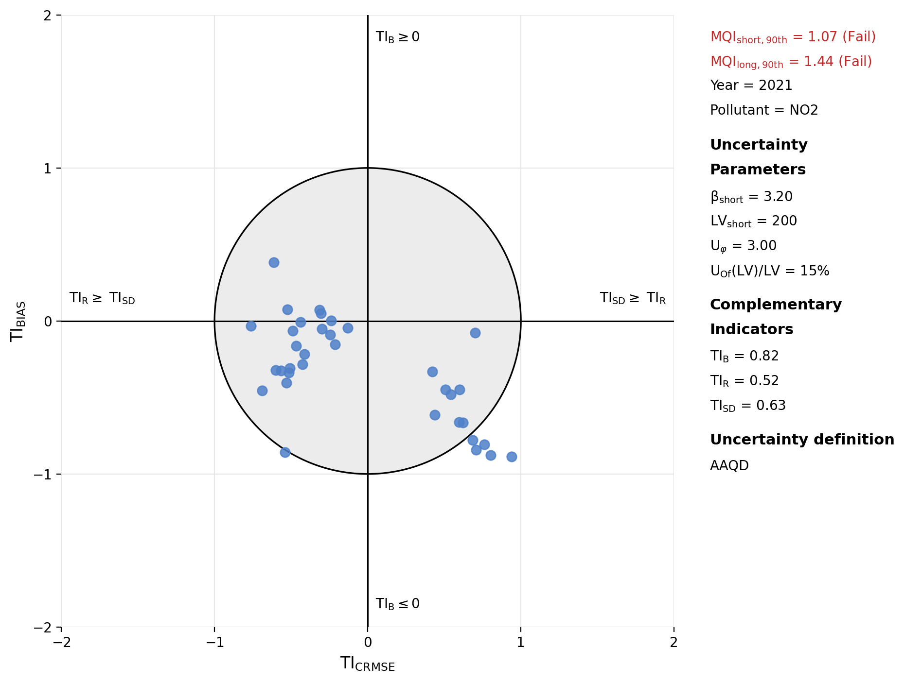
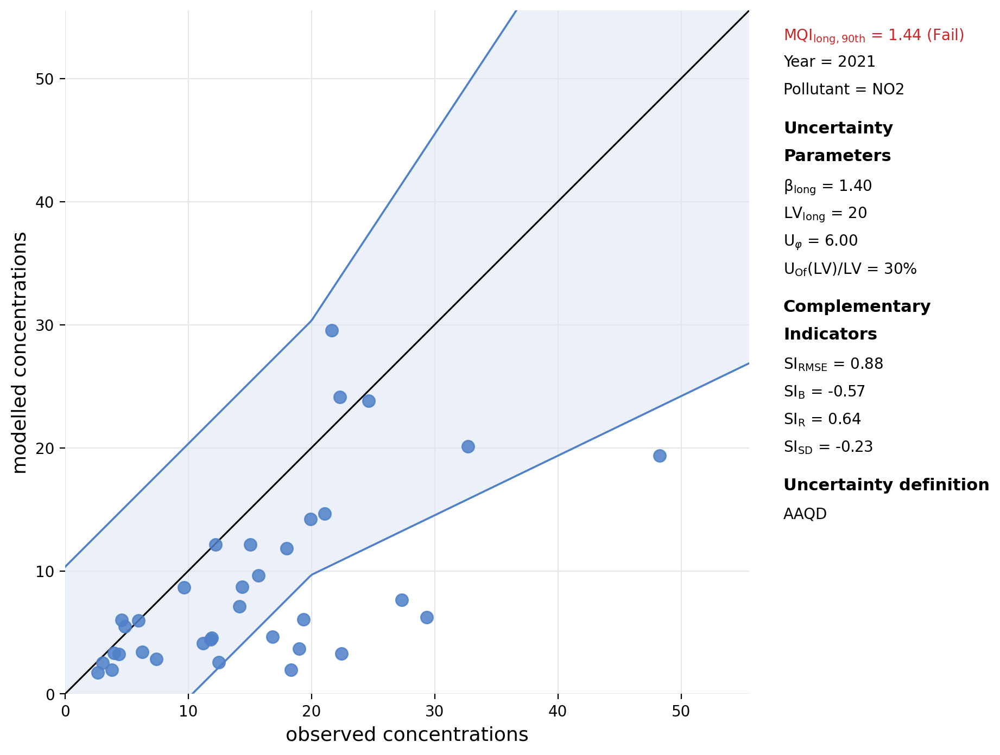
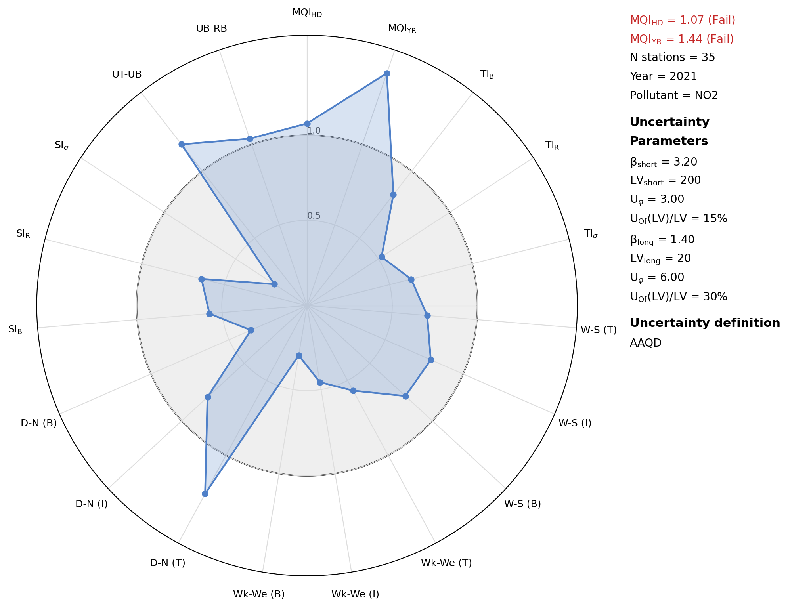
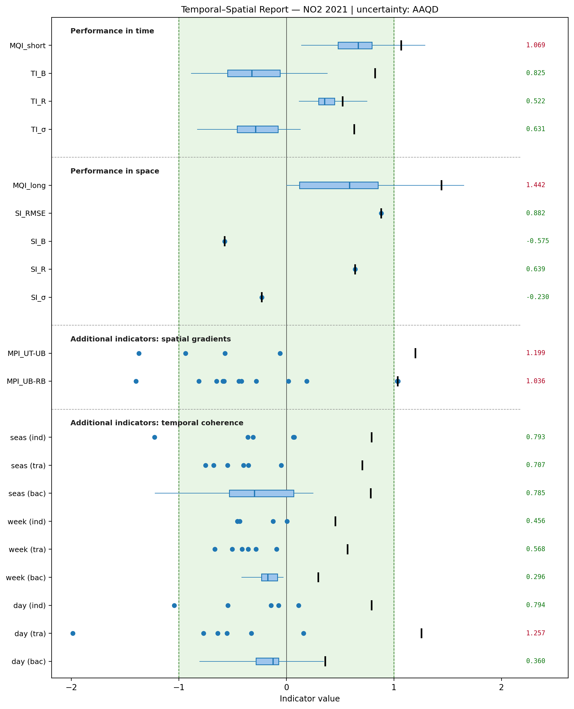
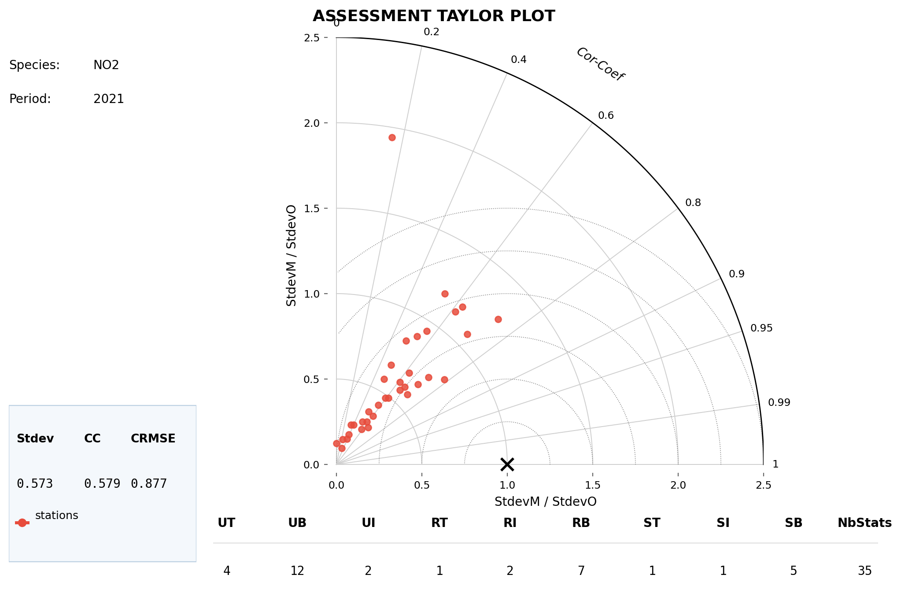
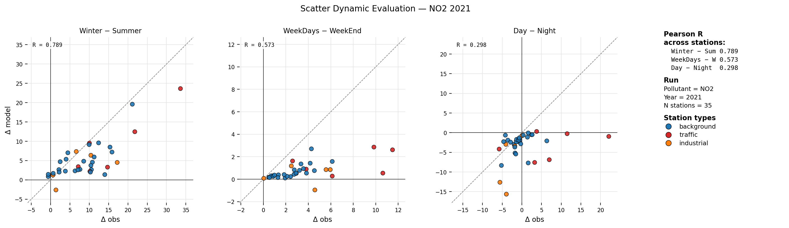
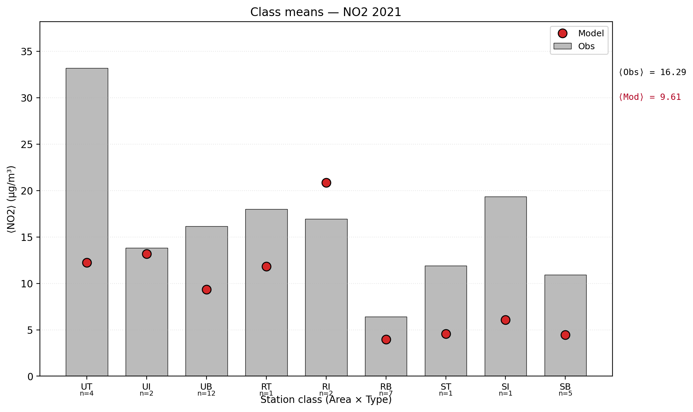

# Plots reading guide

`fmm_assess` produces **eight diagnostic diagrams** per run, each in two
backends:

- **matplotlib** — static PNG under `out/mplotl/`
- **plotly** — interactive HTML under `out/pltly/` (hover tooltips,
  zoom, pan)

The numerical content is **bit-identical** between the two backends:
same indicators, same dot positions, same pass/fail colouring. The
difference is interactivity, not data. Filenames below show the PNG;
the HTML equivalent has the same name with `.html`.

## Contents

- [Triage workflow](#triage-workflow)
- [target.png — short-term Target plot](#targetpng--short-term-target-plot)
- [scatter.png — long-term Scatter plot](#scatterpng--long-term-scatter-plot)
- [radar.png — Radar plot](#radarpng--radar-plot)
- [ts_report.png — Temporal-Spatial Report](#ts_reportpng--temporal-spatial-report)
- [taylor.png — Assessment Taylor plot](#taylorpng--assessment-taylor-plot)
- [scatter_dyneval.png — Dynamic-Evaluation Scatter](#scatter_dynevalpng--dynamic-evaluation-scatter)
- [bars.png — Bar plot](#barspng--bar-plot)
- [timeseries_⟨station⟩.png — Time series](#timeseries_stationpng--time-series)
- [Mixed-network rendering](#mixed-network-rendering)

---

## Triage workflow

**The MQO fails. What do I look at first?**

1. **`radar.png`** — identifies *which family* of errors dominates
   (temporal vs spatial, bias vs amplitude vs timing, contrast
   coherence vs absolute level). Read the polygon spikes.

2. **Drill into the failing family**:
   - Polygon spikes in `MQI_HD` / `TI_*` → look at **`target.png`**
     and **`ts_report.png`** (top rows) for the MQI_short story.
   - Polygon spikes in `MQI_YR` / `SI_*` → look at **`scatter.png`**
     and **`ts_report.png`** (middle rows).
   - Polygon spikes in the coherence axes (`W-S`, `Wk-We`, `D-N`) →
     look at **`scatter_dyneval.png`** and the corresponding rows of
     `ts_report.png`.
   - Polygon spikes in `UT-UB` / `UB-RB` → check `ts_report.png`
     gradient rows (per-station distribution).

3. **`bars.png`** — find the worst stations by absolute bias.

4. **`timeseries_<station>.png`** — for the worst stations identified
   above, see what's actually happening hour by hour.

5. **CSV outputs** — `per_station_<run>.csv` for the row-by-row
   numbers behind every dot you see in the plots.

---

## target.png — short-term Target plot

**Reference**: GD §3.6.2 / DTL DeltaToolLight Target diagram.

**Example (NO₂, 2021).**



In this example, both 90th-percentile MQIs are red — `MQI_short = 1.07`
and `MQI_long = 1.44` — so neither the short- nor the long-term MQO is
fulfilled at the worst-decile of stations. The point cloud sits
**below the y = 0 line** (most dots have `TI_B < 0`), meaning the
model **under-predicts** at most stations. Errors split roughly
evenly between R-dominated (left half, `TI_R ≥ TI_σ`) and σ-dominated
(right half), with a couple of stations drifting outside the disc into
the lower-right quadrant — high amplitude-error stations to investigate
first. The side panel summarises β, LV and `U_φ` used in the
denominator plus the three Complementary Indicators (`TI_B = 0.82`,
`TI_R = 0.52`, `TI_σ = 0.63`).

### What it shows

One dot per station on the dimensionless Target diagram. Axes:

- **x = TI_CRMSE** — signed by whether σ-error (right half) or R-error
  (left half) dominates. The sign assignment is the convention shared
  with MQOR.
- **y = TI_BIAS** — positive upward (model > obs).

The **grey unit disc** is the MQO-fulfilment zone — points inside have
`MQI_short ≤ 1`.

### Side panel

- `MQI_short,90th` and `MQI_long,90th` with pass/fail (green ≤ 1, red > 1).
- Uncertainty parameters used (β, LV, U_φ, U_Of(LV)/LV for AAQD).
- The three temporal MPIs `TI_B`, `TI_R`, `TI_σ` (90th-percentile values).
- Uncertainty definition footer (AAQD).

### How to read

- **Dots inside the disc** → model passes the MQO at that station.
- **Dots outside the disc** → model fails the MQO at that station.
- **Quadrant location tells you the failure mode**:
  - Right half ⇒ amplitude error dominates (σ).
  - Left half ⇒ timing error dominates (R).
  - Upper half ⇒ positive bias (model > obs).
  - Lower half ⇒ negative bias.
- The MQO passes overall if at least 90% of dots are inside the disc.

---

## scatter.png — long-term Scatter plot

**Reference**: GD §3.6.1.

**Example (NO₂, 2021).**



Most points fall **below the black 1:1 line**, confirming the
network-wide under-prediction also seen on the Target plot. About a
third of the stations sit **outside the lower edge of the blue
acceptance corridor** (`O − √(1+β²)·U_O(O)`) — this fraction is what
pushes `MQI_long = 1.44` past the MQO threshold. The corridor widens
linearly above LV = 20 µg/m³ (`U_O(O) = 0.3·O` once O > LV), so the
high-end stations would still pass even with sizable absolute errors;
the failures concentrate at low-to-mid concentrations (10–25 µg/m³).
The side panel shows the four spatial indicators: `SI_RMSE = 0.88`,
`SI_B = −0.57`, `SI_R = 0.64`, `SI_σ = −0.23` (all within `|·| ≤ 1`,
so the network-level SI passes despite the per-station failures).

### What it shows

One dot per station: **x = observed annual mean, y = modelled annual mean**.

- **Black 1:1 line** through the origin marks perfect agreement.
- **Light-blue acceptance corridor** bounded by curved blue edges at
  `O ± √(1+β²)·U_O(O)` marks the MQO-fulfilment region for the long
  term.

### Side panel

Mirrors the target plot but for the long term: `MQI_long` pass/fail
(green/red), uncertainty parameters with `_long` subscripts, and the
four spatial indicators `SI_RMSE`, `SI_B`, `SI_R`, `SI_σ`.

### How to read

- **Dot on the 1:1 line** → model gets the annual mean exactly right at
  that station.
- **Dot above the line** → model over-predicts the annual mean.
- **Dot below the line** → model under-predicts.
- **Dot inside the blue corridor** → model passes `MQI_long ≤ 1` at
  that station.
- **Dot outside the corridor** → model fails the long-term MQO at that
  station.
- The corridor **widens with concentration**: lower concentrations have
  larger relative uncertainty, so larger absolute deviations are
  tolerated at high `O`. A pattern of "all low-O dots pass, all high-O
  dots fail" indicates the model is fine at background sites but
  struggles at hotspots.

---

## radar.png — Radar plot

**Reference**: de Meij et al., GMD 18 4231 2025.

**Example (NO₂, 2021, 35 stations).**



The blue polygon **crosses the unit circle** on three axes:
`MQI_YR ≈ 1.44`, `UT-UB ≈ 1.2` and `D-N (T)` (traffic-class day-night
coherence) ≈ 1.26. These are the three failing MPCs. Everything else
sits comfortably inside the grey unit disc, indicating that the
short-term MQI passes for at least 90 % of stations, the temporal MPIs
are well-bounded, and the spatial complementary MPIs (SI_B, SI_R,
SI_σ) and most coherence cells are healthy. The headline numbers at
top-right (`MQI_HD = 1.07`, `MQI_YR = 1.44`, both red) match what the
Target and Scatter plots report.

### What it shows

A 19-axis polar plot, one axis per indicator. Order (clockwise from
top):

1. `MQI_HD`, `MQI_YR` — the two MQI flavours
2. `TI_B`, `TI_R`, `TI_σ` — temporal complementary MPIs
3. The nine coherence axes (`W-S × {T,I,B}`, `Wk-We × {T,I,B}`, `D-N × {T,I,B}`)
4. `SI_B`, `SI_R`, `SI_σ` — spatial complementary MPIs
5. `UT-UB`, `UB-RB` — spatial gradient MPIs

The **pale-grey unit disc** marks the MPC-fulfilment region.

### Side panel

`N stations`, year, pollutant, both short- and long-term uncertainty
parameters, MQI pass/fail (green/red), and uncertainty definition.

### How to read

- **Polygon entirely inside the unit disc** → every indicator passes
  its MPC. Good model performance across the board.
- **Polygon spikes that cross the unit boundary** → those specific
  indicators fail their MPC. Read the axis label to know which.
- The radar is a **diagnostic dashboard**: one glance tells you which
  family of errors dominates.
  - Spikes only in coherence axes (seas/week/day) → *temporal-pattern*
    problem.
  - Spikes only in spatial axes (SI_*, UT-UB, UB-RB) → *spatial-pattern*
    problem.
  - Spikes in MQI but not in TI_* / SI_* → check the data: missing
    stations, NaN propagation, etc.

The radar is the **first plot to read after a run completes**.

---

## ts_report.png — Temporal-Spatial Report

**Reference**: GD §9.3 / DTL.

**Example (NO₂, 2021).**



This is the most information-dense view in the package, and you can
read all the headline numbers off the right-hand column. Two rows are
red: `MQI_short = 1.069` (just above 1, but failing), and `MQI_long =
1.442` (clearly failing) — the same numbers the Radar and Target plots
showed. The temporal complementary MPIs (`TI_B`, `TI_R`, `TI_σ`) all
pass in the green band (`|·| ≤ 1`). The Spatial-gradients group reveals
two more failures: `MPI_UT_UB = 1.199` and `MPI_UB_RB = 1.036` — the
model doesn't reproduce concentration **increments** between station
classes well, even though the overall spatial pattern (`SI_RMSE = 0.88`)
is fine. In the Temporal-coherence group the only red value is
`day (tra) = 1.257` — the model misses the day-night cycle at
**traffic** stations, consistent with NO₂ being NOₓ-emission-driven
at roadside locations.

### What it shows

Horizontal-bar diagram, one row per indicator. The rows are organised
into **four labelled visual groups**, separated by dashed lines:

1. **Performance in time** — `MQI_short`, `TI_B`, `TI_R`, `TI_σ`
   (per-station distributions + p90 marker).
2. **Performance in space** — `MQI_long` (per-station distribution +
   p90 marker), then the four `SI_*` single scalars
   (`SI_RMSE`, `SI_B`, `SI_R`, `SI_σ`).
3. **Additional indicators: spatial gradients** —
   `MPI_UT-UB`, `MPI_UB-RB` (per-station distribution behind the cell
   scalar).
4. **Additional indicators: temporal coherence** — the
   nine coherence cells `seas/week/day × industry/traffic/background`,
   each showing the per-station signed Δ_s values.

The grouping is **purely cosmetic**: row order, plotted values,
aggregations and CSV outputs are unchanged. Within each row:

The **green band** marks `|x| ≤ 1` (MPC-fulfilment).

- **Blue dots** — one per station.
- **≥ 15 stations** in a row switches to a Tukey box (quartiles +
  whiskers) for readability.
- **Black vertical tick** marks the 90th-percentile (the cell scalar).
- **Rightmost column** prints the p90 value in green (MPC fulfilled)
  or red (failed). `N/A` in grey if the p90 is non-finite (e.g.
  fewer than 2 stations in the class).
- **"no data"** in centre for empty rows.

### How to read

The plot answers **two questions at once**:

1. **Is each indicator under control?** Look at where the black p90
   tick lands relative to the green/red boundary at `x = 1`.
2. **Why?** Look at the distribution of dots. A **tight cluster around
   the p90** means consistent behaviour across the network. A **wide
   spread** means heterogeneous behaviour: some stations are fine,
   others are problematic. Use the spread to decide whether the
   cell-level pass/fail is robust or driven by a few outlier stations.

For the MPI coherence and gradient rows the dots are **signed**, so
the box plot may straddle zero — that's expected. The black p90 tick
is over absolute values, so it always sits in the positive half. See
[`INDICATORS.md`](INDICATORS.md#temporal-coherence-mpis-3x3-grid) for
the formula.

---

## taylor.png — Assessment Taylor plot

**Reference**: GD §9.5.

**Example (NO₂, 2021, 35 stations).**



Most stations cluster in the **lower-left quadrant** of the diagram —
`σ_M/σ_O < 0.5` (model variability is markedly lower than observed) and
correlation coefficient `0 < R < 0.7`. The network-mean stats reported
in the box are consistent: `Stdev = 0.573`, `CC = 0.579`,
`CRMSE = 0.877`. One outlier station sits high on the y-axis with
`σ_M/σ_O ≈ 1.9` and `R ≈ 0.4` — an over-active station with low
correlation, worth flagging. The breakdown table at the bottom shows
the class composition of the 35 stations (12 UB, 7 RB, 5 SB, 4 UT
etc.). Compared with the dimensionless target diagram, the Taylor plot
is best used to spot **dispersion outliers**: stations where the
model's variance is wildly off, even if the mean is acceptable.

### What it shows

Quarter-circle Taylor diagram:

- **Radial axis** — normalised standard deviation `σ_M/σ_O`.
- **Angular axis** — correlation (0 at top of arc, 1 at right axis).

One red dot per station. The **black `×` at (1, 0)** is the reference
(perfect agreement). **Iso-CRMSE dotted arcs** are centred on the `×`.

Footer shows the median across stations of `σ_M/σ_O`, correlation, and
`CRMSE/σ_O`. The bottom row tabulates station counts by (area ×
station-type): `UT, UB, UI, RT, RI, RB, ST, SI, SB, NbStats`.

### How to read

- **Distance from origin** → does the model have the right *amplitude*?
  Dots on the 1.0 arc match the observed variability; dots inside are
  too smooth; dots outside are too noisy.
- **Angle from the horizontal axis** → does the model get the *timing*
  right? Dots close to the right axis have high correlation; dots
  toward the top of the quadrant have low correlation.
- **Distance from the `×`** → total residual error. Dots close to the
  `×` are well-modelled stations.

The Taylor plot is **blind to bias** (it uses centred RMSE). Check
`scatter.png` or `bars.png` for bias information.

---

## scatter_dyneval.png — Dynamic-Evaluation Scatter

**Reference**: GD §9.6.

**Example (NO₂, 2021, 35 stations).**



Three panels for the three temporal contrasts, **dots coloured by
station type** (background, traffic, industrial). The cross-station
Pearson correlations are reported top-left of each panel and at top
right: `R_(W−S) = 0.789`, `R_(Wk−We) = 0.573`, `R_(D−N) = 0.298`. The
Winter–Summer panel is the strongest — observed and modelled seasonal
deltas track each other along the 1:1 line, although the model
systematically under-estimates the contrast (most points below the
diagonal). The Weekday–Weekend panel shows compressed values on both
axes (NO₂ has a modest weekly cycle) and a slightly weaker correlation.
The Day–Night panel is the worst, with `R ≈ 0.3` and a clear pattern of
**model deltas closer to zero** (vertical compression around the
x-axis): the model smooths over the diurnal cycle that the
observations actually carry — consistent with the failing
`day (tra) = 1.257` value in the TS report.

### What it shows

Up to three panels — one per temporal contrast:

1. **Winter–Summer**
2. **Weekdays–Weekend**
3. **Day–Night** (only for hourly aggregation)

Each panel:

- **x-axis** — observed Δ at each station (e.g. winter mean minus
  summer mean).
- **y-axis** — modelled Δ at each station.
- **Dashed grey 1:1 line** through the origin.
- **Dots coloured by station type** (traffic / background / industrial).
- **Pearson R across stations** annotated in the corner.

Side panel: cross-station R for each contrast, run metadata, and
station-type legend.

### How to read

- **Dot on the 1:1 line** → model gets the rhythm *size* right at that
  station.
- **Dot above the line** → model exaggerates the rhythm.
- **Dot below the line** → model underestimates the rhythm.
- **High R, dots off the line** → model gets the *ranking* of stations
  right but the absolute rhythm size wrong (often an emissions issue).
- **Low R** → no relationship between modelled and observed rhythms.
  Serious diagnostic, usually a meteorology or chemistry issue.
- **Colour clusters** (all dots of one station type off in the same
  direction) → station-type-specific problem; check the corresponding
  emission profile.

---

## bars.png — Bar plot

**Reference**: GD §9.7.

**Example (NO₂, 2021).**



Stations are aggregated into the nine area-type × station-type classes
(UT, UI, UB, RT, RI, RB, ST, SI, SB), with the class size annotated as
`n=…`. The **grey bars** (observation means) and **red dots** (model
means) make the under-prediction obvious at a glance: in every class
the red dot sits **below the grey bar**, often by a factor of 2 or
more — most dramatically at UT (n=4, obs ≈ 33, mod ≈ 12). The single
exception is `RI` (n=2), where the model **over-shoots** at ≈ 21 vs
the observed 17 — a small sample (2 stations) that warrants
verification. The headline network-mean values in the right margin
(⟨Obs⟩ = 16.29, ⟨Mod⟩ = 9.61) confirm the systematic under-prediction
the Target and Scatter plots already flagged.

### What it shows

Vertical bars per station:

- **Grey bars** — observation annual mean.
- **Coloured dots overlaid** — model annual mean.
- **Stations grouped/coloured** by station type or area type.

Useful for visualising the **absolute value of bias** at each individual
site. Complements `target.png` (which is normalised) by showing
which stations have raw concentrations of µg/m³ rather than indicator
values.

### How to read

- **Dot above the bar** → model over-predicts at that station.
- **Dot below the bar** → model under-predicts.
- Combine with `target.png` to distinguish absolute vs normalised
  performance: a large bias at a low-concentration station may produce
  a large TI_B; a similar absolute bias at a high-concentration
  station may stay within tolerance.

---

## timeseries_⟨station⟩.png — Time series

**Reference**: GD §9.8.

### What it shows

One figure per requested station: **hourly (or daily) observations in
black, model in colour**, overlaid over the full year.

### How to read

This is the **most diagnostic plot but the slowest to read**. Use it to
investigate specific stations flagged by the radar/target/ts_report
plots:

- Station with very high `TI_R` → desynchronised peaks visible here.
- Station with high `TI_σ` → model amplitude visibly mismatched (too
  smooth or too noisy).
- Station with high `TI_B` → consistent vertical offset throughout the
  year.
- Station with anomalous `MQI_long` → check for end-of-year missing data
  or a major pollution event the model failed to capture.

You don't need a timeseries for every station — request only those
flagged by the diagnostic plots. Configure in `run.yaml`:

```yaml
plots:
  timeseries_stations: [ST001, ST015, ST042]   # explicit list
  # or
  timeseries_stations: worst_mqi_short          # top-3 by MQI_short
```

See [`docs/TECH_SPEC_fmm_assess.md`](TECH_SPEC_fmm_assess.md) for the
full timeseries configuration grammar.

---

## Mixed-network rendering

When a run includes both `fixed` and `indicative` stations (see
[`docs/TECH_SPEC_fmm_assess.md §4.5`](TECH_SPEC_fmm_assess.md) for the
configuration), several plots adapt their rendering to distinguish the
two populations:

### `ts_report.png` mixed mode

- TI rows, MQI rows, MPI gradient rows, MPI coherence rows: **twin
  boxes / dots** — gold above the row centre for `indicative`, blue
  below for `fixed`.
- SI rows: **twin coloured dots** (no box — SI is a single network
  scalar, and in mixed mode `agg.SI_*` is NaN by MQOR convention;
  the per-type values `agg_by_type[mtype].SI_*` are shown instead).
- A thin coloured **reference tick** appears at `max(|per-type|)` on
  each SI row.
- The pooled-p90 black tick is suppressed on SI rows; retained on
  every other row.

### `bars.png` mixed mode

- Two-row layout: top row = `indicative` (triangle markers),
  bottom row = `fixed` (circle markers).
- Aggregate means shown twice in the right margin:
  `⟨Obs⟩_fix` / `⟨Mod⟩_fix` and `⟨Obs⟩_ind` / `⟨Mod⟩_ind`.
- "no data" annotation in grey for empty (mtype × class) combinations.

### `scatter_dyneval.png` mixed mode

- Two-row grid: top row = `indicative` (triangles), bottom row =
  `fixed` (circles), one panel per contrast in each row.
- Per-row Pearson R annotations.

### `radar.png` mixed mode

- 16 non-SI axes plotted normally (single blue dot per axis).
- The 3 SI spokes (`SI_B`, `SI_R`, `SI_σ`) overlay **two coloured dots
  per axis** at the per-type values; the polygon vertex is plotted at
  `max(|per-type|)`. The pooled SI value stored on the aggregate is
  NaN by MQOR convention.

### `taylor.png` mixed mode

- Single Taylor quadrant preserved (cloud-shape semantics need all
  stations in one view).
- Dot **shape** encodes measurement type: circle = `fixed`, triangle =
  `indicative`. Colour stays red.
- Stats footer: twin medians per indicator (one row each for `fix` and
  `ind`).
- Count table: two value rows (one per measurement type) with NbStats
  totals per row.

### `scatter.png` and `target.png`

- Dots **coloured by measurement type** (no shape coding — there's only
  one population per panel).
- Side panel shows twin acceptance-corridor parameters when
  appropriate (the corridor itself is drawn per-type if the parameters
  differ).

### What stays the same

Single-type runs (every station with the same `measurement_type`)
remain **bit-identical** to runs from before the mixed-mode feature
existed. The detection is automatic; you don't need to configure
anything if the network is single-type.

---

*For the formulas underlying every quantity shown in these plots see
[`INDICATORS.md`](INDICATORS.md). For convention details (signing
rules, σ ddof, percentile rule, etc.) see
[`CONVENTIONS.md`](CONVENTIONS.md).*
